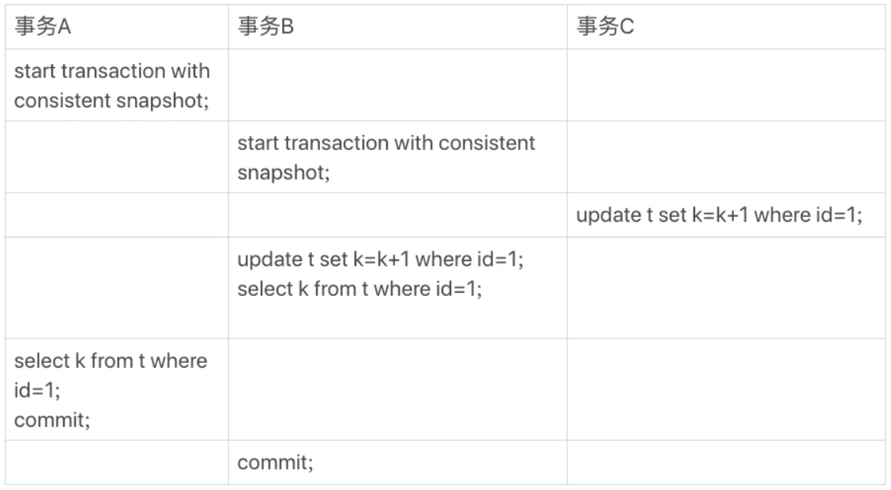

## 一、MySQL基本架构

### 1、MySQL介绍

**MySQL 是一种关系型数据库，主要用于持久化存储我们的系统中的一些数据比如用户信息。**开源免费，默认端口号是**3306**。

是一个**单进程多线程**数据库

> **SQL**：**结构化查询语言**，是一种数据库查询语言，用于**对数据库进行增删改查**等操作；
>
> **数据库**：物理操作系统文件或其他形式文件类型的集合 
>
> **实例：**MySQL数据库有后台线程以及一个共享内存区组成，数据库实例才是操作数据库文件的，在系统上的表现就是一个进程
>
> **关系型数据库：**是一种建立在关系模型的基础上的数据库。关系模型表明了数据库中所存储的数据之间的联系（一对一、一对多、多对多）。
>
> 关系型数据库中，我们的数据都被存放在了各种表中（比如用户表），表中的每一列就存放着一条数据（比如一个用户的信息）。


### 2、MySQL的客户端/服务器架构

MySQL是一个**客户端/服务器架构**

> 日常使用场景如下：
>
> 1、启动MySQL服务器程序
>
> 2、启动MySQL客户端程序
>
> 3、在客户端程序输入命令语句请求发到服务器端，服务器端根据请求内容处理请求并向客户端返回处理结果


**客户端进程向服务器进程**发送请求并得到回复的过程本质上是一个**进程间通信的过程**，MySQL支持三种进程间通信方式：

* **TCP/IP**（服务器与客户端不在同一主机中必须用）

  TCP/IP套接字方式是任何平台均提供的最常用方式

* **命名管道和共享内存**（windows环境可以用）

* **Unix域套接字文件**（类Unix环境可以用）


### 3、MySQL的逻辑架构（一条查询语句是如何执行的）

MySQL的逻辑架构如下：大致分为**Server层和存储引擎层**

Server 层包括连接器、查询缓存、分析器、优化器、执行器等；**存储引擎层负责数据的存储和提取。其架构模式是插件式**的，支持 InnoDB（默认）、MyISAM、Memory 等多个存储引擎。

	

#### （1）**连接器**

负责**与客户端建立连接、获取权限、维持和管理连接**，在完成经典的 TCP 握手后，连接器就要开始认证你的身份（用户名和密码），若正确，回到**权限表查出你拥有的权限**。

> 每当有一个客户端进程连接到服务器进程时，服务器进程都会创建一个线程来专门处理与这个客户端的交互，当该客户端退出时会与服务器断开连接，服务器并不会立即把与该客户端交互的线程销毁掉，而是把它缓存起来，在另一个新的客户端再进行连接时，把这个缓存的线程分配给该新客户端。这样就起到了不频繁创建和销毁线程的效果，从而节省开销。

连接完成后若长时间空闲，默认是8小时，连接器会自行与客户端断开连接。

数据库里面，**长连接**是指连接成功后，如果客户端持续有请求，则**一直使用同一个连接**。**短连接**则是指每次**执行完很少的几次查询就断开**连接，下次查询再重新建立一个。

建立连接的过程通常是比较复杂的，**建议尽量使用长连接**。

> 但是全部使用长连接后，你可能会发现，有些时候 MySQL 占用内存涨得特别快，这是因为 MySQL 在执行过程中临时使用的内存是管理在连接对象里面的。这些资源会在连接断开的时候才释放。所以如果长连接累积下来，可能导致内存占用太大，被系统强行杀掉，从现象看就是 MySQL 异常重启了。
>
> 怎么解决这个问题呢？你可以考虑以下两种方案。
>
> 1. **定期断开长连接**。使用一段时间，或者程序里面判断执行过一个占用内存的大查询后，断开连接，之后要查询再重连。
> 2. 如果你用的是 MySQL 5.7 或更新版本，可以在每次执行一个比较大的操作后，通过执行 mysql_reset_connection 来重新初始化连接资源。这个过程不需要重连和重新做权限验证，但是会将连接恢复到刚刚创建完时的状态。


#### （2）**查询缓存**（8.0版本已删掉）

连接建立完成后，你就可以执行 select 语句了。执行逻辑就会来到第二步：查询缓存。

MySQL 拿到一个查询请求后，会先到查询缓存看看，之前是不是执行过这条语句。之前执行过的语句及其结果可能会以 key-value 对的形式，被直接缓存在内存中。key 是查询的语句，value 是查询的结果。如果能在缓存中找到 key，即查询命中缓存，MySQL 不需要执行后面的复杂操作，就可以直接返回结果，这个效率会很高。

**多数情况下会建议不要使用查询缓存**

缓存虽然能够提升数据库的查询性能，但是缓存同时也带来了**额外的开销：每次查询后都要做一次缓存操作，失效后还要销毁**。

查询缓存的失效非常频繁，**只要有对一个表的更新，这个表上所有的查询缓存都会被清空**。对于更新压力大的数据库来说，查询缓存的命中率会非常低。**除非你的业务就是有一张静态表（例如系统配置表）**，很长时间才会更新一次。


#### （3）**分析器**

MySQL 需要知道你要做什么，因此需要对 **SQL 语句做解析**。

首先做“**词法分析”，识别出字符串的内容分别代表什么**；其次做“**语法分析**”，判断输入的这个 SQL 语句**是否满足 MySQL 语法**。


#### （4）**优化器**

MySQL需要知道该怎么做。

优化的结果就是**生成一个执行计划**，这个执行计划表明了**应该使用哪些索引进行查询，表之间的连接顺序是啥样的**。我们可以使用`EXPLAIN`语句来查看某个语句的执行计划


#### （5）**执行器**

MySQL 通过分析器知道了你要做什么，通过优化器知道了该怎么做，于是就进入了执行器阶段，**开始执行语句**。

开始执行的时候，要先判断一下你对这个表**有没有执行查询的权限**，若有则**调用存储引擎查询结果并将结果集返回给客户端**


### 4、日志系统（一条更新语句如何执行）

与查询流程不一样的是，更新流程还涉及两个重要的日志模块：redo log（重做日志）和bin log（归档日志）

#### （1）redo log（重做日志）

MySQL更改数据的时候，之所以不直接写磁盘文件中的数据，主要因为**直接写磁盘文件是随机写**，开销大性能低。所以先在内存中对数据进行更改，再由后台线程**异步刷新到磁盘**（一般等空闲时）。为**防止断电重启丢失内存内容**，所以还需要加上写日志这个步骤，万一断电重启，还能通过日志中的记录进行恢复。

**写日志到磁盘是顺序写**，相比随机写开销更小，能提升语句执行的性能

这个技术就是**WAL(Write Ahead Log)技术**，也称为**日志先行**的技术，指的是对数据文件进行修改前，必须将修改先记录日志。保证了数据**一致性**和**持久性**，并且提升语句执行性能。

有了 redo log，事务提交过程中任何阶段，MySQL突然奔溃，**重启后都能保证事务的持久性，已提交的数据不会丢失**，这个能力称为**crash-safe**。

redo log记录的是数据库中**每个页的修改**，而不是某一行或某几行修改成怎样，可以用来恢复提交后的物理数据页（恢复数据页，只能恢复到最后一次提交的位置，因为修改会覆盖之前的）。

redo log**固定大小**，只能**循环写**，从头开始写，写到末尾就又回到开头，**相当于一个环形**。当日志写满了，就需要对**旧的记录进行擦除**，但在擦除之前，需要确保这些要被擦除记录对应在内存中的数据页都已经刷到磁盘中了。在redo log满了到擦除旧记录腾出新空间这段期间，是不能再接收新的更新请求，所以有可能会导致MySQL卡顿。（所以针对**并发量大的系统**，适当设置**redo log的文件大小非常重要**）


#### （2）bin log（归档日志）

binlog（归档日志）是MySQL的 Server 层的日志 ，主要记录用户对**数据库操作的SQL语句**（除了查询语句），之所以称为归档日志，是因为不想redo log会擦掉之前的记录而是一直记录，主要用作**主从同步**和数据库**基于某时间点的还原**。（即主从模式下是必须的，若单机模式下，可视情况而定）


这两种日志有以下三点不同。

1. **redo log 是 InnoDB 引擎**特有的；binlog 是 MySQL 的 Server 层实现的，所有引擎都可以使用。
2. redo log 是**物理日志**，记录的是“在**某个数据页上做了什么修改**”；binlog 是**逻辑日志**，记录的是这个**语句的原始逻辑**，比如“给 ID=2 这一行的 c 字段加 1 ”。
3. 两种日志**写入磁盘的时间点**不同，redolog在事务进行中不断地被顺序写入，而binlog只在事务提交时写入一次。
4. **redo log 是循环写的，空间固定会用完**；binlog 是可以追加写入的。**“追加写**”是指 binlog 文件写到一定大小后会切换到下一个，并**不会覆盖以前的日志**。


**MySQL能够恢复到任意时间点的状态就是依赖binlog实现**

> 当需要恢复到指定的某一秒时，比如某天下午两点发现中午十二点有一次误删表，需要找回数据，那你可以这么做：
>
> - 首先，找到最近的一次全量备份；
> - 然后，从备份的时间点开始，将备份的 binlog 依次取出来，重放到中午误删表之前的那个时刻。


#### （3）为什么bin log没有crash-safe

当数据库 crash 后，想要恢复**未刷盘但已经写入 redo log 和 binlog 的数据**到内存时，binlog 是无法恢复的。虽然 **binlog 拥有全量的日志，但没有一个标志让 innoDB 判断哪些数据已经刷盘，哪些数据还没有**。而 redo log 不一样，**只要刷入磁盘的数据，都会从 redo log 中抹掉**，数据库重启后，直接把 redo log 中的数据都恢复至内存就可以了。

> 举个栗子，binlog 记录了两条日志：
>
> 给 ID=2 这一行的 c 字段加1
> 给 ID=2 这一行的 c 字段加1
>
> 在记录1刷盘后，记录2未刷盘时，数据库 crash。重启后，只通过 binlog 数据库无法判断这两条记录哪条已经写入磁盘，哪条没有写入磁盘


#### （4）undo log回滚日志

主要就是提供了**回滚**的作用，但其还有另一个主要作用，就是**多版本并行控制(MVCC)，保证事务的原子性**。在数据修改的流程中，会记录一条与**当前操作相反的逻辑日志到undo log**中（可以认为当delete一条记录时，undo log中会记录一条对应的insert记录，反之亦然，当update一条记录时，它记录一条对应相反的update记录），如果因为某些原因导致事务异常失败了，可以借助该undo log进行回滚，保证事务的原子性，所以undo log也必不可少。


#### （5）update语句的更新流程

```
mysql> update T set c=c+1 where ID=2;
```

1. **执行器先找引擎取 ID=2 这一行**。ID 是主键，引擎直接用树搜索找到这一行。如果 ID=2 这一行所在的数据页本来就在内存中，就直接返回给执行器；否则，需要先从磁盘读入内存，然后再返回。
2. 执行器**拿到引擎给的行数据**，把这个值加上 1，比如原来是 N，现在就是 N+1，得到新的一行数据，**再调用引擎接口写入这行新数据**。
3. 引擎**将这行新数据更新到内存中**，同时将这个更新操作**记录到 redo log** 里面，此时 redo log 处于 **prepare 状态**。然后告知执行器执行完成了，随时可以提交事务。
4. 执行器**生成这个操作的 binlog，并把 binlog 写入磁盘**。
5. 执行器调用引擎的**提交事务接口**，引擎把刚刚写入的 **redo log 改成提交（commit）状态**，更新完成。

	

图中浅色框表示是在 InnoDB 内部执行的，深色框表示是在执行器中执行的。


#### （6）两阶段提交

**为什么redo log要分两步写，中间再穿插写binlog呢？**可用反证法

> 1. **先写 redo log 后写 binlog**。假设在 redo log 写完，binlog 还没有写完的时候，MySQL 进程异常重启。由于我们前面说过的，redo log 写完之后，系统即使崩溃，仍然能够把数据恢复回来，所以恢复后这一行 c 的值是 1。
>    但是由于 binlog 没写完就 crash 了，这时候 binlog 里面就没有记录这个语句。因此，之后备份日志的时候，存起来的 binlog 里面就没有这条语句。
>    然后你会发现，如果需要用这个 binlog 来恢复临时库的话，由于这个语句的 binlog 丢失，这个临时库就会少了这一次更新，恢复出来的这一行 c 的值就是 0，与原库的值不同。
> 2. **先写 binlog 后写 redo log**。如果在 binlog 写完之后 crash，由于 redo log 还没写，崩溃恢复以后这个事务无效，所以这一行 c 的值是 0。但是 binlog 里面已经记录了“把 c 从 0 改成 1”这个日志。所以，在之后用 binlog 来恢复的时候就多了一个事务出来，恢复出来的这一行 c 的值就是 1，与原库的值不同。

如果不使用“两阶段提交”，那么数据库的状态就有可能和用它的日志恢复出来的库的状态不一致。

  


### 5、存储引擎

MySQL服务器把**数据的存储和提取操作**都封装到了一个叫存储引擎的模块里。

MySQL 的server层在完成**查询优化后，执行器只需要按照生成的执行计划调用底层存储引擎提供的API，获取到数据后返回给客户端**。

注意：**存储引擎是基于表的，而不是数据库**。

常用存储引擎：

- **MEMORY引擎**：所有的数据都在内存中，数据的处理速度快，但是安全性不高。


#### （1）InnoDB存储引擎简介

MySQL默认的**事务型**存储引擎，支持**行锁**，支持**外键**，通过使用多版本并发控制（**MVCC**）来获得高并发性，并实现了SQL标准的四种隔离级别，默认为REPEATABLE级别，同时使用一种**Next-Key Locking防止幻读**。

支持真正的在线热备份。其它存储引擎不支持在线热备份，要获取一致性视图需要停止对所有表的写入，而在读写混合场景中，停止写入可能也意味着停止读取。

此外还提供了**插入缓冲**（Insert buffer）、**二次写**（double write）、**自适应哈希索引**（Adaptive hash index）、**预读**（read ahead）等高性能高可用的功能。

InnoDB存储引擎将数据放在一个逻辑的**表空间**中，4.1版本开始后，可以将每个该引擎的表放在一个**独立的ibd文件**中。

对表中数据的存储，采用了**聚集**（cluster）的方法，每张表的存储都是按**主键顺序存放**（若无显示定义主键或唯一键，则会生成一个隐藏列rowid，以此为主键）


#### （2）MyISAM存储引擎简介

不支持事务、行锁、外键

在表读取时，也可以往表中插入新的记录，称为并发插入

MyISAM存储引擎表由MYD和MYI组成，M**YD存放数据文件，MYI存放索引文件**。

与大多数数据库不同的是它的缓**冲池只缓存索引文件，不缓冲数据文件**


#### （3）MyISAM和InnoDB的区别

以下五点，前者均不支持，后者均支持

* 是否支持**事务**

* 是否支持**行锁**

  MyISAM、MEMORY等**只支持表锁**，，而且同一时刻只允许一个用户对表进行写操作，所以这些引擎最好用在只读或大部分读或单用户的情景下，不适合并发场景

* 是否支持**MVCC**

* 是否支持**外键**

  一般也不建议在数据库层面使用外键的，应用层面可以解决，根据项目而定

* 是否支持**数据库异常崩溃后的安全恢复**

  依赖于 `redo log` 

> - MySQL InnoDB 引擎使用 **redo log(重做日志)** 保证事务的**持久性**，使用 **undo log(回滚日志)** 来保证事务的**原子性**。
> - MySQL InnoDB 引擎通过 **锁机制**、**MVCC** 等手段来保证事务的**隔离性**（ 默认支持的隔离级别是 **`REPEATABLE-READ`** ）。
> - 保证了事务的持久性、原子性、隔离性之后，一致性才能得到保障。


#### （4）设置、修改表的存储引擎

**设置表的存储引擎**

```sql
CREATE TABLE 表名{
	建表语句
}ENGINE = 存储引擎名称;
```

**修改表的存储引擎**

```sql
ALTER TABLE 表名 ENGINE = 存储引擎名称;
```


### 6、MySQL字符集

#### （1）字符集

计算机中只能存储二进制数据，为存储字符串数据，需要建立字符与二进制数据的映射关系（解码和编码），人们抽象出一个字符集的概念描述某个字符范围内的编码规则

#### （2）常用字符集

* ASCII字符集

  收录128个字符，所以可用1字节来编码

* ISO 8859-1字符集

  收录256个字符，前者的扩充，可用1字节编码

* GB2312字符集

  收录了汉字等，兼容ASCII字符集，若该字符在ASCII字符集中，则1字节编码，否则2字节编码，即变长编码方式

* GBK字符集

  前者的扩充，编码方式兼容前者，2字节编码

* UTF-8字符集

  收录地球上能想到的所有字符，而且还在不断扩充。兼容`ASCII`字符集，采用变长编码方式，编码一个字符需要使用1～4个字节

  > 准确的说，utf8只是Unicode字符集的一种编码方案，Unicode字符集可以采用utf8、utf16、utf32这几种编码方案，utf8使用1～4个字节编码一个字符，utf16使用2个或4个字节编码一个字符，utf32使用4个字节编码一个字符。


#### （3）MySQL支持的字符集

MySQL中常用utf-8字符集

- `utf8mb3`：阉割过的`utf8`字符集，只使用1～3个字节表示字符。

- `utf8mb4`：正宗的`utf8`字符集，使用1～4个字节表示字符。

在`MySQL`中`utf8`是`utf8mb3`的别名，所以之后在`MySQL`中提到`utf8`就意味着使用1~3个字节来表示一个字符，如果大家有使用4字节编码一个字符的情况，比如存储一些emoji表情啥的，那请使用`utf8mb4`。


### 7、MySQL数据类型

#### （1）整型

> INT(11) 中的**数字只是规定了交互工具显示字符的个数**，对于存储和计算来说是没有意义的。

TINYINT, SMALLINT, MEDIUMINT, **INT**, BIGINT 分别使用 8, 16, 24, **32**, 64 位存储空间，**一般情况下越小的列越好**。


#### （2）浮点数

**FLOAT 和 DOUBLE 为浮点类型，DECIMAL 为高精度小数类型**。CPU 原生支持浮点运算，但是不支持 DECIMAl 类型的计算，因此 **DECIMAL 的计算比浮点类型需要更高的代价**。

FLOAT占用4个字节，DOUBLE占用8个字节；


#### （3）字符串

> VARCHAR(50)：50表示最多存放50个字符；VARCHAR最多存放65532个字符
>
> CHAR(50)：50表示存放50个字符，不足就用空格补齐；CHAR最多存放255个字符

主要有 **CHAR** 和 **VARCHAR** 两种类型，一种是**定长的**，一种是**变长的**。还有TEXT、BLOB

**VARCHAR 这种变长类型能够节省空间**，因为只需要存储必要的内容。但是在执行 **UPDATE 时可能会使行变得比原来长**，当超出一个页所能容纳的大小时，就要执行额外的操作。MyISAM 会将行**拆成不同的片段**存储，而 InnoDB 则需要**分裂页**来使行放进页内。

在进行存储和检索时，会保留 VARCHAR 末尾的空格，而会删除 CHAR 末尾的空格。


#### （4）时间和日期

MySQL 提供了两种相似的日期时间类型：DATETIME 和 TIMESTAMP。

**应该尽量使用 TIMESTAMP，因为它比 DATETIME 空间效率更高。**切忌使用字符串存储日期（占用空间大，比较效率低，无法用日期相关的API）

##### DATETIME

能够保存从 1000 年到 9999 年的日期和时间，精度为秒，使用 **8 字节**的存储空间。它是**时区无关的**。

默认情况下，MySQL 以一种可排序的、无歧义的格式显示 DATETIME 值，例如“2008-01-16 22:37:08”，这是 ANSI 标准定义的日期和时间表示方法。

##### TIMESTAMP（推荐）

**和 UNIX 时间戳相同**，保存从 1970 年 1 月 1 日午夜（格林威治时间）以来的**秒数**，使用 **4 字节**，只能表示从 1970 年到 2038 年。

**它和时区有关**，也就是说**一个时间戳在不同的时区所代表的具体时间是不同的**。

MySQL 提供了 FROM_UNIXTIME() **函数把 UNIX 时间戳转换为日期**，并提供了 UNIX_TIMESTAMP() 函数把日期转换为 UNIX 时间戳。

若插入时未指定 TIMESTAMP 列的值，会将这个值**默认设置为当前时间**。


### 8、数据库设计三大范式

#### （1）第一范式

1NF是对属性的**原子性**，要求属性具有原子性，每一列必须是不可分割的最小单元

> 不能把多个列组合成一个列，比如把邮箱和手机号合为一个列就是不满足第一范式；
>
> 同时也不能把已是不可分割的原子列再进行拆分；


#### （2）第二范式

在满足1NF的基础上，2NF是对记录的**唯一性**，要求**记录有唯一标识**，也就是**要有主键，其他字段都完全依赖于主键，不能只与主键的某一部分相关**（针对联合主键来说）。

**在通俗来讲就是一个数据库表中只能保存一种对象的信息，如果属于这个对象的属性就可以放进来，不属于就不能放进来。不可以把多种对象的数据保存在同一张数据库表中**

> 表：学号、课程号、姓名、学分；
>
> 这个表保存了两种对象的数据:学生信息, 课程信息；这里**学分依赖课程号**，**姓名依赖于学号**，所以不符合二范式。
>
> 正确做法:
> 学生：`Student`(学号, 姓名)；
> 课程：`Course`(课程号, 学分)；
> 选课关系：`StudentCourse`(学号, 课程号, 成绩)。


#### （3）第三范式

**不能有冗余信息**，**数据表中的每个字段都和主键直接相关，而不能间接相关**，**不能存在传递依赖关系**

**通俗来讲，比如一个表描述的这个对象里引用了另一个对象，那么没必要把另一个对象的全部属性都加进来，只需要把它的主键放进来就足够了。**

> 比如一个表: 学号, 姓名, 学院, 学院电话
>
> 这个表存在一种传递依赖关系，学院电话依赖于学院，学院依赖于学号，也就是学院电话并不是直接依赖于学号

如果不满足第三范式的话会有重复冗余的信息，修改时需要同时修改多条记录，否则就会出现**数据不一致的情况** 。

**正确做法：**

学生：(学号, 姓名, 学院)；

学院：(学院, 学院电话)。


## 二、InnoDB存储引擎

### 1、后台线程

后台线程的主要作用是**刷新内存池中的数据，保证缓冲池数据都是最新的数据**；将**已修改的数据文件刷新到磁盘**；**保证数据库发生异常崩溃后，能将数据恢复；**

#### （1）Master Thread

核心后台线程，保证将缓冲池中的数据异步刷新到磁盘，保证数据的一致性（脏页刷新、合并插入缓冲、undo页回收）

#### （2）IO Thread

因为大量使用了AIO（Async  IO）处理写请求，该线程负责这些IO请求的回调处理

#### （3）Purge Thread

事务被提交后。undo日志可能不再需要，该线程负责回收已经使用并分配的undo页

#### （4）Page Cleaner Thread

1.2版本引入，将脏页刷新工作放到该线程处理，减轻Master Thread的压力


### 2、内存

#### （1）缓冲池

**缓冲池是一块内存区域，用来弥补CPU与磁盘速度之间的鸿沟**。缓冲池缓存的数据页类型：数据页、索引页、undo页、插入缓冲、自适应哈希索引等等，绝非只有数据页和索引页。


#### （2）LRU List 、Free List和Flush List

缓冲池通过**LRU算法**来进行管理，**频繁使用**的页放在LRU列表的**前端**，首先**释放末尾的页**，页大小默认16KB

InnoDB的LRU算法对传统算法做了**优化**，再LRU列表中加入了**midpoint位置**，新读取的页并非放入首端，而是放在midpoint位置（默认在LRU列表尾部37%的位置，差不多**3/8**）。该位置前面称作**new列表（热数据），后面为old列表（冷数据）**。

> 主要是为了**避免某些操作例如扫描操作，需要访问许多页甚至全部的页**，这些页通常只在本次操作中需要，并非活跃的热数据，而如果直接放入首部，势必会让LRU列表大换血，导**致真正的热点数据被挤出**

此外，还引入另一个参数表示页读取到该位置后，需要等待多久才会被加入热端


数据刚启动时，LRU列表是空的，此时缓冲池的页都放在**Free列表中**，当**需要缓冲页时**，会从Free表查找是否有**空闲页**，若有，则删除并**加入到LRU列表**


**LRU表中的数据页被修改后，称为脏页**，数据库会通过checkpoint机制将其**刷新到磁盘上**，而**Flush列表的页即为脏页**，注意脏页既存在于LRU也存在于Flush中，**Flush列表只是管理将页刷新回磁盘，而非特定用于存储脏页**


#### （3）重做日志缓冲（redo log）

内存区域除了缓冲池，还有redo log缓冲池，将redo log想放入该区域，之后再异步刷新到重做日志文件。

刷盘时机：

* **master thread以每秒一次**的频率定时刷新
* 每个**事务提交时**会刷新
* 当该**缓冲池剩余空间小于一半**时刷新


#### （4）额外内存池

在对一些数据结构本身的内存进行分配时，需从额外的内存池中进行申请，当该区域内存不够时，会从缓冲池进行申请


### 3、Checkpoint

checkpoint（检查点）技术的目的是解决以下几个问题：

* 缩短数据库的恢复时间
* 缓冲池不够用时，将脏页刷新到磁盘
* redo log不可用时，刷新脏页

当数据库宕机时，无需重做所有的日志，因为checkpoint之前的页都已经刷新回磁盘，故数据库秩序对checkpoint后的重做日志进行恢复即可，缩短恢复时间。


### 4、InnoDB的关键特性

* **插入缓冲**

* **两次写**

* **自适应哈希索引**

  哈希是一种非常快的查找方法，时间复杂度一般为O(1)，一般只需要一次查找就能；而B+树高度一般3~4层，需要3 ~ 4次查找。

  InnoDB存储引擎会监控对表上各索引页的查询。若观察到建立哈希索引可以带来速度提升，则建立哈希索引，称为自适应哈希索引。

  InnoDB会自动根据访问的频率和模式自动地为某些热点页建立哈希索引，它是根据B+树页构造而来，不需要为整张表建立索引。其设计思想是数据库自优化的，无需人为调整

* **异步IO**

  用户可以在发送一个请求后立即发送下一个请求，全部请求发送完后，等待IO操作完成即可，AIO可以进行IO Merge操作，将多个IO合并为一个IO。（访问多个连续的页时）

* **刷新临近页**

  刷新一个脏页时，InnoDB存储引擎会检测该页所在区（extent）的所有页，如果是脏页，那么一起刷新。与IO Merge绝配。


## 三、文件

### 1、参数文件

MySQL数据的参数类型：

* 动态参数

  可以在MySQL实例中进行更改，可通过SET命令更改，关键字session和global分别表示参数修改是基于当前会话还是整个实例的生命周期

* 静态参数

  整个实例的生命周期中不得更改


### 2、日志文件

常见日志文件有：

* 错误日志（err log）
* 二进制（归档）日志（binlog）
* 慢查询日志（slow query log）
* 查询日志（log）

#### （1）错误日志

对MySQL的启动、运行、关闭过程进行了记录。不仅记录了所有错误信息还有一些警告信息或正确信息，DBA遇到问题应首先查看该文件。默认为 ”主机名.err“

#### （2）慢查询日志

帮助DBA定位可能存在问题的SQL语句，进行SQL语句层面的优化，默认关闭

#### （3）查询日志

记录了所有对MySQL数据库请求的信息，默认为“主机名.log”

#### （4）二进制（归档）日志

记录了对MySQL数据库执行更改的所有操作，所以不包括SELECT和SHOW这类操作（该类操作可以查查询日志）。

该日志默认关闭，开始会损失1%的性能，可以接受。

未提交的binlog会被记录到一个缓存中，事务提交时将其写入磁盘。

主要作用：

* **恢复**（recovery）：在一个数据库全备文件恢复后，可以通过binlog进行part-in-time的恢复
* **复制**（replication）：主从复制
* 审计（audit）：判断是否有对数据库进行注入的攻击


### 3、表结构定义文件

每个表都有一个与之对应的frm文件，记录了该表的表结构定义，此外，frm还用来记录视图的定义。


### 4、InnoDB存储引擎文件

#### （1）表空间文件

InnoDB采用将存储的数据按照表空间进行存放的设计。默认有个ibdata1的表空间文件，初始10MB，但是是自增文件

所有记录都会存放在该共享表空间中。此外，用户还可以将每个InnoDB引擎的表产生一个独立表空间：表名.ibd。

注意：独立表空间仅存储该表的数据、索引和插入缓冲BITMAP等，其余信息依旧在共享表空间


#### （2）重做日志文件

同样是记录事务日志，redolog与binlog有什么不同？

* binlog是MySQl Server层实现的，可以记录所有的MySQL记录，而redolog是InnoDB引擎特有的，只记录有关该引擎的记录
* 记录的内容不同，binlog记录的是一个事务的具体操作，是逻辑日志；而redolog记录的是每个页的更改的物理情况，是物理日志
* 写入的时间不同，binlog仅在事务提交前提交，不论事务多大，即只写盘一次；而在事务进行的过程中，却不断有重做日志条目写入到重做日志文件中
* **redolog 是循环写的，空间固定会用完**；binlog 是可以追加写入的。**“追加写**”是指 binlog 文件写到一定大小后会切换到下一个，并**不会覆盖以前的日志**。


## 四、表

### 1、索引组织表

在InnoDB存储引擎中，表**都是根据主键顺序组织存放的**，这种存储方式的表称为**索引组织表**。

在InnoDB存储引擎的表中，**每个表都有主键**，若未显示的定义主键，则会按下面方式选择或创建主键：

* 判断是否有**非空的唯一索引**，有则设为主键
* 否则，自行创建一个**隐藏主键row_id**


### 2、InnoDB逻辑存储结构

所有数据都被逻辑地存放在一个空间中，称为表空间。表空间由段（segment）、区（extent）、页（page）组成。

#### （1）表空间

前文已介绍，分为共享表空间和独立表空间

#### （2）段

常见的段有数据段、索引段、回滚段等，因为InnoDB**存储引擎表是索引组织的**，因此**数据即索引，索引即数据**，数据段也就是B+树的叶子节点，索引段即B+树的非叶子结点。

#### （3）区

区由**连续的页**组成，一个区为1MB，一个页为16KB，那么一个区由64个连续页

> 每个段开始时，先用32个页大小的碎片页来存放数据，在使用完碎片页后才是64个连续页的申请，对于一些小表，这样做可以在开始时申请较少的空间，节省磁盘容量开销

#### （4）页

InnoDB磁盘管理的最小单位

#### （5）行

数据是按行排列的


### 3、InnoDB行记录格式

两种格式存放行记录数据：

* Compact（默认）
* Redundant

#### （1）Compact行记录格式

设计目标是**高效地存储数据**。一个页中存放地**行数据越多，性能也就越高**。

固定长度CHAR字段在未能完全占用其长度时，会用0x20进行填充

不论是CHAR还是VARCHAR，该格式下**NULL值都不占用任何存储空间**

#### （2）Redundant行记录格式

**CHAR类型的NULL值需要占用空间**

#### （3）行溢出数据

InnoDB存储引擎可以**将一条记录的某些数据存在真正的数据页面之外**。

如果某一列中的数据非常多的话，在本记录的真实数据处只会存储**该列的前768个字节的数据**和一个**指向其他页的地址**，然后把剩下的数据存放到其他页中，这个过程也叫做行溢出，存储超出`768`字节的那些页面也被称为溢出页

	

> VARCHAR类型最大支持**65535，单位是字节**。
>
> VARCHAR(N)中的**N指的是字符的长度，并非字节长度**，不同字符集中，字符占用的字节数不一样，即使同一字符集，也不一定一样

#### （4）Compressed和Dynamic行记录格式

这俩行格式和`Compact`行格式挺像，只不过在处理**`行溢出`数据时有点儿分歧**，它们不会在记录的真实数据处存储字段真实数据的前`768`个字节，而是把所有的字节都存储到其他页面中，只在记录的真实数据处存储其他页面的地址


### 4、InnoDB数据页结构

#### （1）File Header

记录各种页都通用的一些头信息。描述了针对各种页的通用信息。例如：

* 每个数据页的`File Header`部分都有上一个和下一个页的编号，所以**所有的数据页会组成一个双链表**，无需物理上相连。

* 每个页都有一个页号，InnoDB**通过页号可以唯一定位一个页**。
* 校验和与File Trailer中相对应

#### （2）Page Header

记录数据页的状态信息

#### （3）Infimum和Supremum Record

每个数据页有两个虚拟的行记录，用来限定记录的边界。Infimum是比数据页中任何主键值都要小的值，同理另一个。

#### （4）User Record和Free Space

User Record是实际存储行记录的内容。

Free Space是空闲空间，链表数据结构。每当我们插入一条记录，都会从该部分，也就是尚未使用的存储空间中申请一个记录大小的空间划分到User Records部分，在一条记录被删除后，加入空闲链表中。

#### （5）Page Directory（页目录）

**B+树索引只能找到记录所在的页，将页载入内存中，再通过page directory进行二分查找才能找到具体的记录**。

`InnoDB`会为把页中的**记录划分为若干个组**，每个组的最后一个记录的页内地址偏移量作为一个`槽`，存放在`Page Directory`中，所以在一个页中根据主键查找记录是非常快的，分为两步：

- 通过**二分法**确定该记录所在的**槽**。
- 通过**记录的next_record**属性**遍历**该槽所在的组中的各个记录。

> 每个记录的头信息中都有一个`next_record`属性，从而使页中的所有记录串联成一个`单链表`。

#### （6）File Trailer

为保证从内存中同步到磁盘的页的完整性，在页的首部和尾部都会存储页中数据的校验和和页面最后修改时对应的`LSN`值，如果首部和尾部的校验和和`LSN`值校验不成功的话，就说明同步过程出现了问题。

> 这个部分是和`File Header`中的校验和相对应的。每当一个页面在内存中修改了，在同步之前就要把它的校验和算出来，因为`File Header`在页面的前边，所以校验和会被首先同步到磁盘，当完全写完时，校验和也会被写到页的尾部，如果完全同步成功，则页的首部和尾部的校验和应该是一致的。如果写了一半儿断电了，那么在`File Header`中的校验和就代表着已经修改过的页，而在`File Trialer`中的校验和代表着原先的页，二者不同则意味着同步中间出了错。


### 5、约束

关系型数据库系统和文件系统地一个不同在于，关系数据库本身能保证存储数据的完整性，无需程序控制。几乎所有的关系型数据库都支持约束机制，来保证数据库的完整性。

#### （1）数据完整性

一般来说数据完整性有三种形式：

* 实体完整性保证表中有一个主键（通过PRIMARTY KEY或UNIQUE KEY保证）
* 域完整性保证数据每列的值满足特定的条件（通过选定合适的数据类型或外键或触发器保证）
* 参照完整性保证两张表之间的关系（通过外键或触发器保证）

> InnoDB提供了以下几种约束：
>
> * Primary Key 主键约束
> * Unique Key 唯一键约束
> * Foreign Key 外键约束
> * Default 默认
> * NOT NULL 非空约束


#### （2）约束和索引的区别？

用户**创建了一个唯一索引就创建了一个唯一的约束**，但是约束和索引的概念还是有所不同的：**约束是一个逻辑概念，用来保证数据的完整性**，而**索引是一个数据结构，既有逻辑上的概念，在数据库中也还代表着物理存储的方式**。


#### （3）外键约束

外键建立时，InnoDB会自动对该列创建一个索引，可以很好地避免外键列上无索引而导致地死锁问题。

对于参照完整性，外键很有用。但是对于**数据导入时，外键往往导致在外键约束的检查上花费大量时间，因为外键是即时检查的，所以对于导入的每一行都会检查，严重影响性能。**


### 6、视图

**什么是视图**

视图(VIEW)是一个**虚拟的表**，**一组数据的逻辑表示**，是从数据库中一个或多个表中导出来的，内容由查询定义。视图本身不包含任何数据，这些数据仍然存放在原来的表（基表）中。使用视图查询数据时，仍然从基表中取数据，一旦基表中的数据变化，视图中的数据也会相应改变。

**特点：**

* 视图的列可以来自不同的表；
* 视图是由基表（实表）产生的虚表；
* 视图的建立和删除不影响基表；
* 对视图内容的更新（增删改）会影响基表；
* 当视图来自多个基表时，不允许添加和删除数据

**优点：**

* 简单性

  简化用户对数据的理解和操作，看到的就是需要的，可以将那些经常使用到的查询定义为视图，简化操作；

* 安全性

  可以防止未授权用户查看特定的行或列，使有权限用户只能看到表中特定行

* 逻辑数据独立性

  视图可以使应用程序和数据库表在一定程度上独立。如果没有视图，程序一定是建立在表上的。有了视图之后，程序可以建立在视图之上，从而程序与数据库表被视图分割开来。视图可以在以下几个方面使程序与数据独立。

  （1）如果应用建立在数据库表上，当数据库表发生变化时，可以在表上建立视图，通过视图屏蔽表的变化，从而使应用程序可以不动。

  （2）如果应用建立在数据库表上，当应用发生变化时，可以在表上建立视图，通过视图屏蔽应用的变化，从而使数据库表不动。

  （3）如果应用建立在视图上，当数据库表发生变化时，可以在表上修改视图，通过视图屏蔽表的变化，从而使应用程序可以不动。

  （4）如果应用建立在视图上，当应用发生变化时，可以在表上修改视图，通过视图屏蔽应用的变化，从而使数据库可以不动。


## 五、索引

**什么是索引？**

**索引是一种用于快速查询和检索数据的数据结构。**索引就相当于目录，通过对内容建立索引形成目录，方便查找书中的内容。


**InnoDB支持以下几种常见索引：**

* B+树索引

  **B+树索引并不能找到具体的行记录，而是找到记录所在的页，将页读入内存在通过页目录进行二分查找找到相应的记录。**

  

* 全文索引

  MyISAM 存储引擎支持全文索引，InnoDB 存储引擎在 MySQL 5.6.4 版本中也开始支持全文索引。

  用**于查找文本中的关键词，而不是直接比较是否相等**。

  查找条件使用 MATCH AGAINST，而不是普通的 WHERE。

  

* 自适应哈希索引

  哈希索引的设计思想是**数据库自适应的，不能人为干预的**，InnoDB存储引擎会**根据表的使用情况在B+树上自动创建一个哈希索引。**
  
  哈希索引能以O(1)时间查询，但是失去了有序性：
  
  * **无法用于排序和分组**
  * **只能用于精确等值查找，无法范围查找**


### 1、B+树

> B+树中的B不是代表二叉（Binary），而是代表平衡（Balance），因为B+树从最早的平衡二叉树演化而来，但并不是二叉树

#### （1）B+的由来

B+树是通过**二叉搜索树**，再由**平衡二叉树**，**B树**演化而来。

* 在二叉搜索树中，左子树的键值总是小于根节点的键值，右子树的键值总是大于根节点的键值。可以通过中序遍历得到键值的排序输出，但对于同一键值序列，二叉搜索树可以有不同的构造，查找效率也不同。**若想最大性能构造二叉搜索树，需要这颗二叉搜索树是平衡的。**

* 平衡二叉树（AVL树）：首先满足二叉搜索树定义，满足**任何节点的两个子树的高度最大差为1**。但平衡二叉树的**维护具有一定的开销**（插入或删除结点），不过一般多用于内存结构对象，维护开销相对较小。

* B树与AVL树不同的是其属于**多叉树**，且所有**叶子节点均在同一层**，每个节点都存有索引（Key）和数据（Value）


#### （2）B树与B+树的区别

B+树是B树的一种变体，不同之处在于：

* B 树的所有节点既存放键(key) 也存放数据(data)，而 **B+树只有叶子节点存放 key 和 data，非叶子节点只存放 key**。这使得B+树每个**非叶子节点能保存的关键字增加**，树的**层级也就更少**，查询更快。

  > 有k个子树的中间节点包含有k个元素，而B树中是k-1个元素
  >
  > 	

* B 树的叶子节点都是独立的，而B+树的叶子节点有一条**引用链指向与它相邻的叶子节点**。

* B 树的检索的过程相当于对范围内的**每个节点的关键字做二分查找，可能还没有到达叶子节点，检索就结束了**。而 B+树的**检索效率更稳定**，任何查找都是从根节点到叶子节点的过程（每次查询次数都相同），叶子节点形成了一条有序链表，**全局遍历只需要遍历所有叶子节点**即可。


#### （3）B+树的不同实现方式

在 MySQL 中，MyISAM 引擎和 InnoDB 引擎都是使用 B+Tree 作为索引结构，但是，两者的实现方式不太一样。

**MyISAM 引擎中，索引文件和数据文件是分离的**，**B+Tree 叶节点的 data 域存放的是数据记录的地址**。在索引检索的时候，首先按照 B+Tree 搜索算法搜索索引，如果指定的 Key 存在，则取出其 data 域的值，然后以 data 域的值为地址读取相应的数据记录。这被称为“非聚簇索引”。

**InnoDB 引擎中，其数据文件本身就是索引文件**。其**表数据文件本身就是按 B+Tree 组织的一个索引结构**，树的叶节点 data 域保存了完整的数据记录。这个索引的 key 是数据表的主键，因此 InnoDB 表数据文件本身就是主键索引。这被称为“聚簇索引”，而其余的索引都作为辅助索引，**辅助索引的 data 域存储相应记录主键的值而不是地址**。


#### （4）MyISAM中的索引方案

虽然也是采用B+树结构，但是却将索引和数据分开存储：

* 将表中记录按照**插入顺序存储**到一个**数据文件**中，这个文件并不划分数据页，可以**通过行号快速访问**到一条记录。
* 将索引信息存储到一个**索引文件**中，MyISAM会单独为主键创建一个索引，但是该索引的叶子节点并非完整行记录，而是“主键值+行号”，即**先通过索引找到行号，再通过行号去访问行记录**。


### 2、B+树索引

B+树索引的本质就是B+树在数据库中的实现，但是B+树在数据库中有一个特点是高扇出性，**所以高度一般在2到4层，即查找一次需要2到4次IO**。


#### （1）聚簇索引

```
ALTER TABLE 'table_name' ADD PRIMARY KEY('column');
```

聚簇索引其实是一种**数据存储方式**，聚簇索引**将索引和数据放在了一起**，无需回表。

InnoDB中的**主键索引就是聚簇索引**，就是**按照每张表的主键构造一棵B+树**，**叶子节点是数据页，存放是整张表的完整行记录数据**；

**非叶子结点是索引页**，存放的是**主键值和指向数据页的偏移量**。

> 聚簇索引的存储不是物理上连续的，是逻辑上连续的。一是**所有的页按照主键大小，通过双向链表链接**；二是**页中的所有记录也是通过双向链表按主键排序的**。
>
> 因此聚簇索引十分适用于**主键的排序查找和范围查找**。


#### （2）辅助（二级）索引

非聚簇索引：MYISAM就是非聚簇索引，**索引和数据分离**，一般需要回表操作（除非覆盖索引）。

非主键索引都是非聚簇索引，**叶子节点存放的是“索引列+主键值”**。然后再根据**主键值通过聚簇索引**来找到一个完整的行记录所在的数据页（该操作称作**回表**）。

常见二级索引：

* **普通索引**

  ```
  ALTER TABLE 'table_name' ADD INDEX index_name('column');
  ```

* **唯一索引**

  ```
  ALTER TABLE 'table_name' ADD UNIQUE('column');
  ```

* **联合索引**

  ```
  ALTER TABLE 'table_name' ADD INDEX index_name('column1', 'column2');
  ```

* **前缀索引**

  ```
  ALTER TABLE 'table_name' ADD INDEX index_name(column(10));
  ```

* **全文索引**

  ```
  ALTER TABLE 'table_name' ADD FULLTEXT('column');
  ```


#### （3）索引的优点

- 大大加快了数据查询检索的速度。

- 帮助服务器**避免进行排序和分组**，**索引是有序的**，可以用于 ORDER BY 和 GROUP BY 操作。

  > 比如使用ORDER BY将查询结果按照某个字段排序时，若未建立索引，那么需要在额外对查询结果进行排序；
  >
  > 而如果建立了索引，由于索引本身就是有序的，所以直接按照索引顺序取出即可；

- 将随机 I/O 变为**顺序 I/O**（B+Tree 索引是有序的，会将相邻的数据都存储在一起）


### 3、B+树索引的使用

#### （1）索引的缺点

* **空间上的代价**

  **每建立一个索引都要为它建立一棵B+树**，B+树的每个节点都是一个16KB大小的数据页，**占用物理存储空间**。

* **时间上的代价**

  **创建索引和维护索引都需要耗费时间**。每次对表中的数据进行增删改操作，都要去维护表对应的每个B+树索引


#### （2）回表与覆盖索引

使用二级索引查询时，以范围查询为例，一般根据二级索引查询的记录在磁盘中的存储都是连续的、集中的分布在一个页或几个页中，可以很快读出来，一般称为**顺序IO**；但是这些记录对应的主键值都是分散的，可能分布在很多个不同的数据页中，需要对磁盘进行离散读，称为**随机IO**。

所以根据二级索引查询一般有如下特点：

* 会用到两个B+树索引，一个二级索引，一个聚簇索引
* 访问二级索引使用顺序IO，访问聚簇索引使用随机IO

需要回表的记录越多，使用二级索引的性能就越低，甚至不如用全局扫描。**查询优化器会根据统计数据来估算两种方式的性能开销决定采用索引还是全局扫描。**


为了**避免回表**操作带来的性能开销，最好在查询字段中就只包含索引列，这样就不用回表去聚簇索引中查询了，所以把**只需要用到索引列的查询方式称为覆盖索引**。

使用覆盖索引的一个好处是，二级索引不含所有记录信息，其大小远小于聚簇索引，可以减少大量的IO操作。


#### （3）索引适用条件

* **全值匹配**

  如果查询语句的**搜索条件中的列和索引列一致**的话，这种情况就称为全值匹配

* **匹配最左边的列**

  其实查询语句的**搜索条件**中也可以不用包含全部联合索引中的列，**只包含左边的就行**。

  因为`B+`树的数据页和记录先是按照联合索引最左边的列值排序的，在左边列值相同时，才会用右边的列值排序。

  如果我们想使用联合索引中尽可能多的列，搜索条件中的各个列必须是联合索引中从最左边连续的列

* **匹配列前缀**

  B+树中对字符串列的排序规则一般是**逐个比较字符的大小**，类似于联合索引的排序方式，排序好的字符串列一般有下特点：

  * 先按照字符串的第一个字符进行排序。
  * 如果第一个字符相同再按照第二个字符进行排序。

  * 如果第二个字符相同再按照第三个字符进行排序，依此类推。

  也就是说这些字符串的前n个字符，也就是**前缀都是排好序**的，所以对于字符串类型的索引列来说，我们**只匹配它的前缀也是可以快速定位记录**的，比方说我们想查询名字以`'As'`开头的记录，那就可以这么写查询语句：

  ```
  SELECT * FROM person_info WHERE name LIKE 'As%';
  ```

  但是需要注意的是，如果**只给出后缀或者中间**的某个字符串则无法定位，只能全局扫描，比如这样：

  ```
  SELECT * FROM person_info WHERE name LIKE '%As%';
  ```

  如果有时不得不按照后缀查询，那可以将表中数据逆序存储，这就可以将后缀转为前缀了。

* **匹配范围值**

  因为B+树中的记录都是按照索引列的值升序排列好的，索引对于范围查找速度特别快。

* **用于排序、分组**

  比如ORDER  BY子句用到索引列的话，那么直接按照索引顺序取就好了，不用再将查询结果进行额外的排序操作；

  


#### （4）创建索引注意事项

- 对于**非常小的表**、大部分情况下**全表扫描**比建立索引更高效；对于**中到大型的表**，**索引**就非常有效；但是对于**特大型的表**，建立和维护索引的代价将会随之增长。这种情况下，需要用到一种技术可以直接区分出需要查询的一组数据，而不是一条记录一条记录地匹配，例如可以使用**分区技术**。

* 只为**经常用于查询、排序、分组的列**创建索引，索引的字段尽量不含NULL

* **考虑列的选择性**

  即某列中不重复数据的个数与总数的比值，选择性越大，每个记录的区分度越高，查询效率也越高，最好为具有高选择性的列建立索引。

* **索引列的数据类型（数据能表示的范围）尽量小**

  数据类型越小，在查询是进行比较操作则越快；占用存储空间更小，数据页可以存放更多的记录，减少磁盘IO，而且可放在内存缓冲区的数据页也更多，加快读写效率

* **频繁更新的列应慎重建立索引**

  因为更新操作，需要对索引进行维护，成本很高。

* **使用覆盖索引**

  避免回表的性能开销

* **使用联合索引**

  在使用多个列作为查询条件时，比单列索引效果好，节约存储空间

* **使用前缀索引**

  即只对字符串（例如BLOB、TAXT和VARCHAR）的前几个字符进行索引，既**节省存储空间**（二级索引叶子节点不用再存储完整的字符串值了），又**减少了字符串比较时间**（不用将每个字符都一一比较了）

* **使用自增主键**

  让存储引擎自行生成递增主键，每插入一条记录，都是追加操作，不涉及挪动其他记录，也不会触发页面分裂，而有业务逻辑的字段做主键，则往往不容易保证有序插入，这样写数据成本相对较高。而且自增主键相对节约存储空间。

* **索引列单独出现**

  如果是索引列以某个表达式或者函数调用方式出现，会造成无法命中索引

* **删除冗余、重复、长期未用的索引**


#### （5）扩展知识--Cardinality值

这是索引中一个非常关键的值，表示索引中唯一值的数目的估计值，查询优化器会根据这个值来判断是否使用这个索引，但该值并非实时更新，只是一个大概的值

并不是所有在查询条件中出现的列都需要建立索引，一般经验是，在**访问表中很少一部分时使用索引才有意义**。对于性别字段、地区字段、类别字段，它们的可取范围很小，称为低选择性。

例如按性别查询，每次查询结果都包含了50%的数据，此时添加索引就是没必要的。相反，如果某个字段取值范围很广，几乎无重复，即属于**高选择性，则使用索引非常合适。**

而查看索引是否具有高选择性就可以通过SHOW INDEX结果中的列Cardinality值来观察。

数据库对于该值的统计都是通过采样的方法来完成的


## 六、事务

### 1、认识事务

#### （1）什么是事务？

**事务是一个不可分割的数据库操作序列**，**是逻辑上的一组操作**，**要么都执行，要么都不执行**。


#### （2）事务的ACID特性

InnoDB存储引擎支持的事务是完全满足ACID特性的，其他引擎并不一定（例如NDB Cluster不满足D，Oracle默认事务隔离级别READ COMMITTED，不满足I）

* **A（Atomicity），原子性**

  **事务是不可分割的最小执行单位**，事务中的所有操作要么全都完成，要么全都不做。

* **C（Consistency），一致性**

  一致性保证将数据库从一种一致的状态转变为另一种一致的状态。**执行事务前后，数据库的完整性约束未被破坏**。

* **I（Isolation），隔离性**

  也称并发控制。简而言之，**多个用户并发访问数据库时，一个用户的事务不被其他用户事务干扰，彼此独立**）

* **D（durablity），持久性**

  **事务一旦提交，其结果就是永久性的**。即使发生宕机，数据库也能将其恢复。保证事务系统的高可靠性。


#### （3）事务的类型

* **扁平事务**

  最简单，最频繁使用的事务，所有操作处于同一层次，其间操作是原子的，要么都执行，要么都回滚。

  主要限制是不能提交或回滚事务的某一部分，或分几个步骤提交。

* **带保存点的扁平事务**

  允许在事务执行过程中回滚到同一事务中较早的一个状态。

  保存点用来通知系统应记住事务当前状态，保存点有易失性，而非持久的，系统宕机后会丢失。

  > 定义保存点的语法：
  >
  > ```
  > SAVEPOINT 保存点名称
  > ```
  >
  > 回滚到某个保存点：
  >
  > ```
  > ROLLBACK TO 保存点名称
  > ```

* **链事务**

  保存点模式的一种变种。提交事务时将必要的上下文隐式传给下一要开始的个事务，即提交事务操作与下一个事务操作合并为一个原子操作，下个事务可以看到上一个事务的结果，好像在一个事务中进行一样

* **嵌套事务**

  一个层级结构框架，由一个顶层事务控制着各个层次的事务，如同一棵树一般；InnoDB引擎并不支持。

  > 嵌套事务是由若干事务组成的一棵树，处在叶子节点的是扁平事务，根节点的事务称为顶层事务，在其他称作子事务。子事务既可以提交也可以回滚，但是任何子事务都必须要顶层事务提交后才真正的提交。
  >
  > 树中任意一个事务的回滚都会引起它的所有子事务的回滚，故子事务只有ACI，没有D特性。
  >
  > 可以发现，实际工作是由叶子节点完成的，高层事务只负责逻辑控制。
  >
  > 虽然可以用保存点技术模拟嵌套事务，但是在锁的持有方面还是有所不同的，用户无法选择哪些锁需要被子事务继承，哪些需要被父事务保留，即无论有多少保存点，所有被锁住的对象都可以被得到访问，所以要实现事务间的并行性，需要真正支持的嵌套事务

* **分布式事务**

  通常是在一个分布式环境下运行的扁平事务，因此需要根据数据所在位置访问网络中的不同节点。

  > 假设一个用户在ATM机进行银行的转账操作，例如持卡人从招商银行的储蓄卡转账10000元到工商银行的储蓄卡。在这种情况下，可以将ATM机视为节点A，招商银行的后台数据库视为节点B，工商银行的后台数据库视为节点C，这个转账的操作可以分解为以下的步骤：
  > 1，节点A发出转账命令；
  > 2，节点B执行储蓄卡中的余额值减去10000；
  > 3，节点C执行储蓄卡中的余额值加上10000；
  > 4，节点A通知用户操作完成或者节点A通过用户操作失败。
  >
  > 这里需要使用分布式事务，因为节点A不能通过调用一台数据库就完成操作。其需要访问网络中两个节点的数据库，而在每个节点的数据库执行的事务操作又都是扁平的。对于分布式事务，其同样需要满足ACID特性，要么都发送，要么都失效。对于上述的例子，如果2,3步中任何一个操作失败，都会导致整个分布式事务回滚。若非这样，结果会很严重。

对于InnoDB存储引擎来说，上面五种只有嵌套事务并不原生支持，因此，**对有并行事务需求的用户来说，MySQL数据库或InnoDB存储引擎就显得无能为力了**。然而用户仍可以通过带有保存点的事务模拟串行的嵌套事务。


#### （4）MySQL中事务的用法

* 开启

  ```mysql
  BEGIN|START TRANSACTION
  ```

* 提交

  ```mysql
  COMMIT
  ```

* 手动回滚

  ```mysql
  ROLLBACK
  ```

* 创建保存点

  ```mysql
  SAVEPOINT identifier
  ```

* 回滚到保存点

  ```mysql
  ROLLBACK TO identifier
  ```

* 设置事务的隔离级别

  ```mysql
  SET TRANASCTION
  ```

* 自动提交

  默认情况下，若不使用BEGIN|START TRANACTION显式的开启事务，那么**每一条语句都算是一个独立的事务，执行完语句立马自动执行COMMIT，这称为事务的自动提交**

* 隐式提交

  因为某些特殊语句而导致事务提交的情况称为隐式提交

  * 定义或修改数据库对象的数据定义语言（Data definition language，DDL），所谓数据库对象就是数据库、表、视图等，当我们使用CREATE、ALTER、DROP等语句时，就会隐式提交前边语句所属的事务。

  * 隐式使用或修改mysql数据库中的表
  * 事务控制或关于锁定的事务
  * ……

#### （5）对事务操作的统计

InnoDB引擎需要在考虑每秒请求数（Question Per Second，QPS）的同时，应该关注每秒事务处理的能力（Transaction Per Second，TPS）。


### 2、事务的实现

事务的隔离性由锁来实现。持久性由重做日志（redo log）实现。undo log用来帮助事务回滚和MVCC的功能。redo日志基本上是顺序写的，undo log是需要进行随机读写的。

#### （1）redo log

redo log再第一章已经介绍过了，这里主要以补充为主。

**什么是redo log**

我们进行的增删查改操作均是在Buffer Pool中进行的，可是如果事务提交后，内存断电导致数据丢失，如何保证事务的持久性呢？一个简单做法是，在事务提交时就将该事务所修改的所有页面都刷新到磁盘，但是这种方法，一方面直接刷新一个完整的数据页太浪费了，毕竟有时仅更改了页面中很少的地方；另一方面该事务所修改的页面可能并不相邻，刷盘需要随机IO。

为了解决这个问题我们只需要把页面修改的内容记录一下就好，在事务提交时，将其刷到磁盘，但系统崩溃需要恢复时，用其恢复即可。redo日志是顺序写入磁盘的，每执行一条语句，可能产生若干日志，根据产生顺序写入磁盘，即顺序IO


**Mini-Transaction概念**

把对底层页面中的一次原子访问的过程称之为一个`Mini-Transaction`，简称`mtr`，例如向某个索引对应的`B+`树中插入一条记录的过程即是一个`Mini-Transaction`。一个所谓的`mtr`可以包含一组`redo`日志，在进行崩溃恢复时这一组`redo`日志作为一个不可分割的整体。

一个事务可以包含若干条语句，每一条语句其实是由若干个`mtr`组成，每一个`mtr`又可以包含若干条`redo`日志。

	


**fsync操作**

redo log分为两部分：一是内存中的重做日志缓冲（ redo log buffer），是易失的；而是重做日志文件（redo log file），是持久的。

**为了确保每次日志都真正写入到重做日志文件中了**，在每次将重做日志缓冲写入重做日志文件后**，InnoDB引擎都要调用一次fsync操作**。

fsync的效率取决于磁盘性能，因此磁盘性能也决定了事务提交的性能，也就是数据库的性能。

> 应用程序向磁盘写入文件时其实是先写到操作系统的文件系统缓存，如果某个写入操作要等到操作系统确认已经写到磁盘时才返回，那需要调用一下操作系统提供的fsync函数。
>
> 如果不进行该操作，当操作系统宕机时，重启数据库后会损失未从文件系统缓存刷新到重做日志文件中的那部分事务。而如果仅数据库宕机的话，并不会有损失。


**redo log buffer刷盘时机**

* master thread每隔一秒会刷盘一次
* 当redo log buffer空间不足一半时
* 事务提交时
* log checkpoint时


**LSN（Log Sequence Number）**

其代表的是日志序列号，表示事务写入重做日志的字节的总量。

> 例如，当前重做日志的LSN为1100，若事务T1写入100字节的重做日志，那么LSN变为1100，T2写入200字节重做日志，LSN变为1300。LSN越小，说明重做日志产生的越早。


`redo`日志是首先写到`log buffer`中，之后才会被刷新到磁盘上的`redo`日志文件。全局变量`buf_next_to_write`，标记当前`log buffer`中已经有哪些日志被刷新到磁盘中了。画个图表示就是这样：

	

我们前边说`lsn`是表示当前系统中写入的`redo`日志量，这包括了写到`log buffer`而没有刷新到磁盘的日志，相应的，全局变量`flushed_to_disk_lsn`表示刷新到磁盘中的`redo`日志量，当该值与lsn相同时，说明log buffer中的所有redo日志都已经刷新到磁盘中


LSN不仅存在于重做日志文件中，还存在于每个页中，表示该页最后刷新时LSN的大小，用来判断页是否需要进行恢复操作。


**恢复**

checkpoint表示已经刷新到磁盘页上的LSN，因此恢复时只需要恢复checkpoint开始的日志部分，即恢复大于checkpoint LSN的日志。


#### （2）undo log

* 为了**保证事务的原子性，需要支持回滚操作**，所以每当我们要进行增删改操作时，需要留一手——将回滚时需要的东西记下来，这就需要undo log。undo log存放数据库内部的一个特殊段——undo段，其位于共享表空间。

* **undo log是逻辑日志，只是将数据库逻辑地恢复到原来地样子，使所有的修改都被逻辑地取消**，但是数据结构和页本身回滚后可能大不相同，因为在多用户并发系统中，可能有多个事务同时对同一页中地记录做修改，**所以一个事务的回滚并不能将页回滚到事务开始前的样子，因为这样会影响其他事务正在进行的工作。**

* 当将插入事务回滚时，表空间的大小并不会因此而收缩。**回滚时，实际上做的是与之前相反的操作，对于每个INSERT，相应的都有一个DELETE来抵消掉。**

* 除了回滚操作，另一个作用就是**MVCC。当用户读取一行记录时，若该记录已被其他事务占用，当前事务可通过undo读取之前的行版本信息，以实现非锁定读取。**

* 最后，undo log的产生也会产生redo log，因为undo log也需要持久化保护。

* **事务提交时**，InnoDB引擎会做两件事：

  * 将**undo log放入链表中，是否最终删除由purge线程来判断操作**
  * 判断undo log所在的页是否可以重用，若可以分配给下个事务使用

  **事务提交后，并不能马上删除undo log和其所在的页，因为可能还有其他事务需要通过undo log来得到行记录之前的版本**

* undo log格式

  * insert undo log

    **因为insert操作的记录只对本事务可见，这是事务隔离性的要求，所以该undo log可以在事务提交后直接删除，无需purge操作**

  * update undo log

    **针对delete操作和update操作产生。该undo log可能需要支持MVCC机制，所以不能直接删除，提交时放入链表，候purge发落**


#### （3）purge

执行DELETE语句或者更新主键的UPDATE语句并不会立即把对应的记录完全从页面中删除，而是执行一个所谓的delete mark操作，相当于只是对记录打上了一个删除标志位。

而purge用于最终完成delete和update操作。因为InnoDB支持MVCC，事务提交时不能立即进行处理，因为其他事务可能也正在应用同一行记录。所以需要保存记录之前的版本。当该记录不被任何其他事务引用时，方可被后台purge进程真正删除。

 


### 3、事务的隔离级别

> `MySQL`是一个`客户端／服务器`架构的软件，对于同一个服务器来说，可以有若干个客户端与之连接，每个客户端与服务器连接上之后，就可以称之为一个会话（`Session`）。每个客户端都可以在自己的会话中向服务器发出请求语句，一个请求语句可能是某个事务的一部分，也就是对于服务器来说可能同时处理多个事务。
>
> 事务有个特性称为`隔离性`，理论上在某个事务对某个数据进行访问时，其他事务应该进行排队，当该事务提交之后，其他事务才可以继续访问这个数据。但是这种串行化方式性能较差，我们既想保持事务的`隔离性`，又想让服务器在处理访问同一数据的多个事务时性能尽量高些，所以隔离性和性能要有所取舍。

#### （1）事务并发执行时会遇到的问题

* **脏写（dirty write）**

  如果一个事务修改了另一个未提交事务修改过的数据，即发生了脏写

* **脏读（dirty read）**

  如果一个事务读取了另一个未提交事务修改过的数据，即发生了脏读

* **不可重复读（non-repeatable read）**

  如果一个事务只能读到已提交的事务修改过的数据，而且其他事务每对该数据进行修改并提交后，该事务都能查询到最新值，即发生了不可重复读

* **幻读（plantom read）**

  如果一个事务先根据某些条件查询出一些记录后，之后另一个事务又插入了符合这些条件的记录，原先的事务再次按照该条件查询时，能把另一个事务插入的记录也读出来，那就意味着发生了幻读。

  > 幻读强调的是一个事务按照某个相同条件多次读取记录时，后读时读到了之前没读到的记录。对于先前已读到，后读又未读到的情况相当于对每一条记录都发生了不可重复读现象。


#### （2）SQL标准中的隔离级别

* **READ UNCOMMITTED：未提交读**

  一个事务还没提交时，它做的变更就能被别的事务看到。

* **READ COMMITTED：已提交读**

  一个事务提交之后，它做的变更才会被其他事务看到。

* **REPEATABLE READ：可重复读**

  一个事务执行过程中看到的数据，总是跟这个事务在启动时看到的数据是一致的，除非是自己修改的数据。

* **SERIALIZABLE：可串行化**

  顾名思义是对于同一行记录，“写”会加“写锁”，“读”会加“读锁”。当出现读写锁冲突的时候，所有事务必须逐个**串行执行**。

由于脏写问题太严重了，不论是哪种隔离级别，都不允许脏写的情况发生。


**举例：**

下面是按照时间顺序执行两个事务的行为：

	

- 若隔离级别是“未提交读”， 则V1的值就是2。这时候事务B虽然还没有提交，但是结果已经被A看到了。因此，V2、V3也都是2。
- 若隔离级别是“已读提交”，则V1是1，V2的值是2。事务B的更新在提交后才能被A看到。所以， V3的值也是2。
- 若隔离级别是“可重复读”，则V1、V2是1，V3是2。之所以V2还是1，遵循的就是这个要求：事务在执行期间看到的数据前后必须是一致的。
- 若隔离级别是“串行化”，则在事务B执行“将1改成2”的时候，会被锁住。直到事务A提交后，事务B才可以继续执行。所以从A的角度看， V1、V2值是1，V3的值是2。

在实现上，数据库里面会**创建一个视图**，访问的时候以视图的逻辑结果为准。在“**可重复读**”隔离级别下，这个视图是在**事务启动时**创建的，整个事务存在期间都用这个视图。在“**已提交读**”隔离级别下，这个视图是在**每个SQL语句开始执行**的时候创建的。

这里需要注意的是，“**未提交读**”隔离级别下**直接返回记录上的最新值，没有视图**概念；而“**串行化**”隔离级别下直接用**加锁**的方式来避免并行访问。

> 每个隔离级别都有它自己的使用场景，根据业务情况来定。那什么时候需要“**可重复读”的场景**呢？
>
> 假设你在管理一个个人银行账户表。一个表存了每个月月底的余额，一个表存了账单明细。这时候你要做数据校对，也就是判断上个月的余额和当前余额的差额，是否与本月的账单明细一致。你一定希望在校对过程中，即使有用户发生了一笔新的交易，也不影响你的校对结果。
>
> 这时候使用“可重复读”隔离级别就很方便。事务启动时的视图可以认为是静态的，不受其他事务更新的影响。


#### （3）MySQL中支持的四种隔离级别

不同的数据库厂商对`SQL标准`中规定的四种隔离级别支持不一样，比方说`Oracle`就只支持`READ COMMITTED`和`SERIALIZABLE`隔离级别。

MySQL虽然支持4种隔离级别，但与SQL标准中所规定的各级隔离级别允许发生的问题却有些出入，**MySQL在REPEATABLE READ隔离级别下，使用Next-Key Lock锁的算法，是可以禁止幻读问题的发生的，即达到SQL标准中的SERIALIZABLE级别**

`MySQL`的默认隔离级别为`REPEATABLE READ`，我们可以手动修改一下事务的隔离级别。

我们可以通过下边的语句修改事务的隔离级别：

```
SET [GLOBAL|SESSION] TRANSACTION ISOLATION LEVEL level;
```

其中的`level`可选值有4个：

```
level: {
     REPEATABLE READ
   | READ COMMITTED
   | READ UNCOMMITTED
   | SERIALIZABLE
}
```


### 4、MVCC

#### （1）版本链

在可重复读隔离级别下，**事务在启动的时候就“拍了个快照”**。注意，这个快照是基于整库的。实际上，我们并不需要拷贝出整个数据库的数据。我们先来看看**这个快照是怎么实现的？**

InnoDB里面**每个事务有一个唯一的事务ID**，叫作trx_id（transaction id）。它是在事务开始的时候向InnoDB的事务系统申请的，是按申请顺序严格递增的。

而**每行数据也都是有多个版本的**。**每次事务更新数据的时候，都会生成一个新的数据版本，并且把trx_id赋值给这个数据版本的事务ID**，记为row trx_id。同时，旧的数据版本要保留，并且在新的数据版本中，能够有信息可以直接拿到它。

即**数据表中的一行记录，其实可能有多个版本(row)，每个版本有自己的row trx_id**。下图就是一个记录被多个事务连续更新后的状态。

	

图中虚线框里是同一行数据的4个版本，当前最新版本是V4，k的值是22，它是被transaction id 为25的事务更新的，因此它的row trx_id也是25。

之前说过，语句更新会生成undo log吗？那么，**undo log在哪呢？**

实际上，图中的三个虚线箭头，就是undo log；而V1、V2、**V3并不是物理上真实存在的，而是每次需要的时候根据当前版本和undo log计算出来的**。比如，需要V2的时候，就是通过V4依次执行U3、U2算出来。

> 实际上insert undo只在事务回滚时起作用，当事务提交后，该类型的undo日志就没用了，它对MVCC没什么用，它没有历史版本。它占用的Undo Log Segment也会被系统回收。


#### （2）ReadView

> 前面已说过，对于使用`READ UNCOMMITTED`隔离级别的事务来说，由于可以读到未提交事务修改过的记录，所以直接读取记录的最新版本就好；对于使用`SERIALIZABLE`隔离级别的事务来说，使用加锁方式来访问记录即可；

对于使用`READ COMMITTED`和`REPEATABLE READ`隔离级别的事务来说，**都必须保证读到已经提交了的事务修改过的记录**，也就是说假如另一个事务已经修改了记录但是尚未提交，是不能直接读取最新版本的记录的，核心问题就是：**需要判断一下版本链中的哪个版本是当前事务可见的。**

> 在MySQL里，有两个“视图”的概念：
>
> - 一个是view。它是一个用查询语句定义的虚拟表，在调用的时候执行查询语句并生成结果。创建视图的语法是create view ... ，而它的查询方法与表一样。
> - 另一个是InnoDB在实现MVCC时用到的**一致性读视图**，即consistent read view，用于支持RC（Read Committed，读提交）和RR（Repeatable Read，可重复读）隔离级别的实现。
>
> 它没有物理结构，作用是事务执行期间用来定义“我能看到什么数据”

为此，提出了一个`ReadView`的概念，这个`ReadView`中主要包含4个比较重要的内容：

* `m_ids`：表示在生成`ReadView`时当前系统中**活跃（启动还未提交）的读写事务的`事务id`列表**。

* `min_trx_id`（低水位）：表示在生成`ReadView`时当前系统中活跃的读写事务中最小的`事务id`，也就是**`m_ids`中的最小值**。

* `max_trx_id`（高水位）：表示生成`ReadView`时系统中**应该分配给下一个事务的`id`值**，即已经创建过的事务ID的最大值加1

* `creator_trx_id`：表示**生成该`ReadView`的事务**的`事务id`。

  	

有了这个`ReadView`，这样在访问某条记录时，只需要按照下边的步骤判断记录的某个版本是否可见：

- 如果被访问版本的`trx_id`**等于`creator_trx_id`**值，表明当前事务**在访问它自己修改过的记录**，该版本可以被当前事务访问。

- 如果被访问版本的`trx_id`落在**绿色部分**，表明**生成该版本的事务**在当前事务生成`ReadView`**前已提交**，该版本可以被当前事务访问。

- 如果被访问版本的`trx_id`落在**红色部分**，表明**生成该版本的事务**在当前事务生成`ReadView`**后才开启**，该版本不可被当前事务访问。

- 如果被访问版本的`trx_id`落在**黄色部分**，若其**在`m_ids`列表中**，说明创建`ReadView`时生成该版本的事务还是活跃的**尚未提交**，该版本不可以被访问；**若不在，说明创建`ReadView`时生成该版本的事务**已经被提交，该版本可以被访问。

如果某个版本的数据对当前事务不可见的话，那就顺着版本链找到下一个版本的数据，继续按照上边的步骤判断可见性，依此类推，直到版本链中的最后一个版本。

**InnoDB利用了“所有数据都有多个版本”的这个特性，实现了“秒级创建快照”的能力。**

在`MySQL`中，`READ COMMITTED`和`REPEATABLE READ`隔离级别的的一个非常大的区别就是它们**生成ReadView的时机不同**：

* READ COMMITTED：该隔离级别的事务，在每次语句执行前都会生成一个独立的ReadView。
* REPEATABLE READ：该隔离级别的事务，只需在事务真正开始时生成一个ReadView，之后事务里的其他查询不会再重复生成。


#### （3）实例

> ```
> mysql> CREATE TABLE `t` (
>   `id` int(11) NOT NULL,
>   `k` int(11) DEFAULT NULL,
>   PRIMARY KEY (`id`)
> ) ENGINE=InnoDB;
> insert into t(id, k) values(1,1),(2,2);
> ```
>
> 	
>
> 如果我告诉你事务B查到的k的值是3，而事务A查到的k的值是1

**Case1:**

这里，我们不妨做如下假设：

1. 事务A开始前，系统里面只有一个活跃事务ID是99；
2. 事务A、B、C的版本号分别是100、101、102，且当前系统里只有这四个事务；
3. 三个事务开始前，(1,1）这一行数据的row trx_id是90。

这样，事务A的视图数组就是[99,100], 事务B的视图数组是[99,100,101], 事务C的视图数组是[99,100,101,102]。

为了简化分析，我先把其他干扰语句去掉，只画出跟事务A查询逻辑有关的操作：

	

从图中可以看到，第一个有效更新是事务C，把数据从(1,1)改成了(1,2)。这时候，这个数据的最新版本的row trx_id是102，而90这个版本已经成为了历史版本。

第二个有效更新是事务B，把数据从(1,2)改成了(1,3)。这时候，这个数据的最新版本（即row trx_id）是101，而102又成为了历史版本。

你可能注意到了，在事务A查询的时候，其实事务B还没有提交，但是它生成的(1,3)这个版本已经变成当前版本了。但这个版本对事务A必须是不可见的，否则就变成脏读了。

好，现在事务A要来读数据了，它的视图数组是[99,100]。当然了，读数据都是从当前版本读起的。所以，事务A查询语句的读数据流程是这样的：

- 找到(1,3)的时候，判断出row trx_id=101，比高水位大，处于红色区域，不可见；
- 接着，找到上一个历史版本，一看row trx_id=102，比高水位大，处于红色区域，不可见；
- 再往前找，终于找到了（1,1)，它的row trx_id=90，比低水位小，处于绿色区域，可见。

这样执行下来，虽然期间这一行数据被修改过，但是事务A不论在什么时候查询，看到这行数据的结果都是一致的，所以我们称之为一致性读。

这个判断规则是从代码逻辑直接转译过来的，但是正如你所见，用于人肉分析可见性很麻烦。

所以，我来给你翻译一下。一个数据版本，对于一个事务视图来说，除了自己的更新总是可见以外，有三种情况：

1. 版本未提交，不可见；
2. 版本已提交，但是是在视图创建后提交的，不可见；
3. 版本已提交，而且是在视图创建前提交的，可见。

现在，我们用这个规则来判断图4中的查询结果，事务A的查询语句的视图数组是在事务A启动的时候生成的，这时候：

- (1,3)还没提交，属于情况1，不可见；
- (1,2)虽然提交了，但是是在视图数组创建之后提交的，属于情况2，不可见；
- (1,1)是在视图数组创建之前提交的，可见。

你看，去掉数字对比后，只用时间先后顺序来判断，分析起来轻松很多。


**Case2:**

事务B的update语句，如果按照一致性读，好像结果不对？事务B的视图数组是先生成的，之后事务C才提交，不是应该看不见(1,2)吗，怎么能算出(1,3)来？

是的，如果事务B在更新之前查询一次数据，这个查询返回的k的值确实是1。

但是，当它要去更新数据的时候，就不能再在历史版本上更新了，否则事务C的更新就丢失了。因此，事务B此时的set k=k+1是在（1,2）的基础上进行的操作。

所以，这里就用到了这样一条规则：**更新数据都是先读后写的，而这个读，只能读当前的值，称为“当前读”（current read）。**

因此，在更新的时候，当前读拿到的数据是(1,2)，更新后生成了新版本的数据(1,3)，这个新版本的row trx_id是101。

所以，在执行事务B查询语句的时候，一看自己的版本号是101，最新数据的版本号也是101，是自己的更新，可以直接使用，所以查询得到的k的值是3。

这里我们提到了一个概念，叫作当前读。其实，除了update语句外，**select语句如果加锁，也是当前读。**

所以，如果把事务A的查询语句select * from t where id=1修改一下，加上lock in share mode 或 for update，**也都可以读到版本号是101的数据，返回的k的值是3**。下面这两个select语句，就是分别加了读锁（S锁，共享锁）和写锁（X锁，排他锁）。

```mysql
mysql> select k from t where id=1 lock in share mode;
mysql> select k from t where id=1 for update;
```


**Case3:**

再往前一步，假设事务C不是马上提交的，而是变成了下面的事务C’，会怎么样呢？

	

事务C’的不同是，更新后并没有马上提交，在它提交前，事务B的更新语句先发起了。前面说过了，虽然事务C’还没提交，但是(1,2)这个版本也已经生成了，并且是当前的最新版本。那么，事务B的更新语句会怎么处理呢？

这时候，根据“**两阶段锁协议**”。事务C’没提交，也就是说(1,2)这个版本上的写锁还没释放。而事务B是当前读，必须要读最新版本，而且必须加锁，因此就被锁住了，必须等到事务C’释放这个锁，才能继续它的当前读。

到这里，我们把一致性读、当前读和行锁就串起来了。

可重复读的核心就是一致性读（consistent read）；而事务更新数据的时候，只能用当前读。如果当前的记录的行锁被其他事务占用的话，就需要进入锁等待。


#### （4）小结

**MVCC**（Multi-Version Concurrency Control ，**多版本并发控制**）指的就是在使用`READ COMMITTD`、`REPEATABLE READ`这两种隔离级别的事务**在执行普通的查询操作时访问记录的版本链的过程**，可以**实现事务的并发执行，从而提升系统性能**。

MVCC，**就是通过生成一个`ReadView`，然后通过`ReadView`找到符合条件的行记录版本**（历史版本是由`undo日志`构建的），其实就像是在**生成`ReadView`的那个时刻**拍了一个**快照**，**查询语句只能读到在生成`ReadView`之前已提交事务所做的更改，在生成`ReadView`之前未提交的事务或者之后才开启的事务所做的更改是看不到的**。

解决了脏读、不可重复读、幻读的问题。


以“REPEATABLE READ”为例概括下事务隔离的实现：

在MySQL中，实际上每条记录在更新的时候都会同时记录一条回滚操作。记录上的最新值，通过回滚操作，都可以得到前一个状态的值。假设一个值从1被按顺序改成了2、3、4，在回滚日志里面就会有类似下面的记录。

	

当前值是4，但是在查询这条记录的时候，**不同时刻启动的事务会有不同的read-view**。如图中看到的，在视图A、B、C里面，这一个记录的值分别是1、2、4，同一条记录在系统中可以存在多个版本，就是数据库的多版本并发控制（MVCC）。对于read-view A，要得到1，就必须将当前值依次执行图中所有的回滚操作得到。

同时你会发现，即使现在有另外一个事务正在将4改成5，这个事务跟read-view A、B、C对应的事务是不会冲突的。


**回滚日志总不能一直保留，具体什么时候可以删除呢？**

就是当系统里没有比这个回滚日志更早的read-view的时候。

**基于上面的说明，我们来讨论一下为什么建议你尽量不要使用长事务？**

长事务意味着系统里面会存在很老的事务视图。由于这些事务随时可能访问数据库里面的任何数据，所以这个事务提交之前，数据库里面它可能用到的回滚记录都必须保留，这就会导致大量占用存储空间。除了对回滚段的影响，长事务还占用锁资源，也可能拖垮整个库，这个我们会在后面讲锁的时候展开。


### 5、不好的事务习惯

#### （1）在循环中提交

当发生错误时，数据库会停留在一个未知的位置。例如，用户需要插入10000条用户记录，在第5000条时，发生了错误，这时前面的记录都已经提交，并存在数据库中了，此时该如何处理？

另一个问题是性能问题，每次提交都要写一次重做日志，相比于将所有操作放在一个事务中进行，无疑增加了大量的性能损耗。

#### （2）使用自动提交

编写应用程序开发时，最好把事物的控制权交给开发人员，即在程序端进行事务的开始和结束。

#### （3）使用自动回滚

对于开发人员来说，重要的不是知道发生了错误，而是发生了什么样的错误，因此自动回滚存在这样一个问题。


## 七、锁

### 1、并发事务带来的问题

并发事务访问相同记录情况有三：

#### （1）**读 - 读**

没问题，允许发生


#### （2）写 - 写

可能发生脏写，不允许。多个未提交事务相继修改同一记录时，是要排队执行，通过锁实现。所谓锁其实是一种内存中的结构，当事务要对该记录做改动时，首	先检查有无与该记录关联的锁结构，没有则添加一个。

	

上述简化锁结构：

* trx信息：表示该锁是哪个事务生成的

* is_waiting：表示当前事务是否在等待

当事务T1加锁成功后（is_waiting为false），事务可以正常执行；当T2也想改动该记录时，发现已有锁结构与之关联，于是也生成一个锁结构（is_waiting为true，表示当前事务需要等待），加锁失败。T1提交后，会把其锁结构释放掉，把T2对应线程唤醒，继续执行。

	


#### （3）**读 - 写**

可能发生脏读、不可重复读、幻读。


#### （4）如何解决读-写带来的问题

* **方案一：读操作利用MVCC，写操作加锁**

  MVCC前面已介绍过，**就是通过生成一个`ReadView`，然后通过`ReadView`找到符合条件的记录版本**（历史版本是由`undo日志`构建的），其实就像是在**生成`ReadView`的那个时刻**做了一次时间静止（就像用相机拍了一个**快照**），**查询语句只能读到在生成`ReadView`之前已提交事务所做的更改，在生成`ReadView`之前未提交的事务或者之后才开启的事务所做的更改是看不到的**。而**写操作针对的是最新版本的记录，读记录的历史版本和改动记录的最新版本本身并不冲突，也就是采用`MVCC`时，`读-写`操作并不冲突。**

  

* **方案二：读写操作均加锁**

  如果我们的一些**业务场景不允许读取记录的旧版本，而是每次都必须去读取记录的最新版本**。比方在银行存款的事务中，你需要先把账户的余额读出来，然后将其加上本次存款的数额，最后再写到数据库中。在将账户余额读取出来后，就不想让别的事务再访问该余额，直到本次存款事务执行完成，其他事务才可以访问账户的余额。这样在**读取记录的时候也就需要对其进行`加锁`操作**，这样也就意味着`读`操作和`写`操作也像`写-写`操作那样排队执行。

  > * 脏读的产生是因为当前事务读取了另一个未提交事务写的一条记录，如果**另一个事务在写记录的时候就给这条记录加锁（写加锁），那么当前事务就无法继续读取该记录**了，所以也就不会有脏读问题的产生了。
  >
  > * 不可重复读的产生是因为当前事务先读取一条记录，另外一个事务对该记录做了改动之后并提交之后，当前事务再次读取时会获得不同的值，如果在**当前事务读取记录时就给该记录加锁（读加锁），那么另一个事务就无法修改该记录**，自然也不会发生不可重复读了。
  > * 幻读的产生是因为当前事务读取了一个范围的记录，然后另外的事务向该范围内插入了新记录，当前事务再次读取该范围的记录时发现了新插入的新记录，我们把**新插入的那些记录称之为幻影记录**。加锁的方式解决幻读问题就麻烦了，因为当前事务在第一次读取记录时那些幻影记录并不存在，所以读取的时候并不知道给哪条记录加锁，这个下面会讲。


  显然，采用`MVCC`方式的话，`读-写`操作彼此并不冲突，性能更高，采用`加锁`方式的话，`读-写`操作彼此需要排队执行，影响性能。但具体还需看业务场景


### 2、锁的理论知识

#### （1）一致性读

**事务利用MVCC进行的读取操作称为一致性读，也称快照读**，所有**普通的SELECT语**句（plain SELECT）在 READ COMMITED 和 REPEATABLE READ隔离级别下都算是一致性读。**一致性读不会对表中任何记录进行加锁，其他事务可以自由对表中记录做改动。**


#### （2）锁定读

> UPDATE、DELETE、INSERT、SELECT … LOCK IN SHARE MODE、SELECT … FOR UPDATE是当前读。

**也称当前读，读取的是最新版本，使用加锁方式，既要满足读-读操作不受影响，也要使写-写、读-写情况中的操作相互阻塞**，所以设计了两种锁：

* 共享锁（Shared Locks，S锁）。事务读取一条记录时，需要先获取该记录的S锁。
* 独占锁（Exclusive Locks，X锁）。事务改动一条记录前，需先获取该记录的X锁。

S锁只和S锁兼容，X锁与任意锁都不兼容。

| 兼容性 |  `X`   |  `S`   |
| :----: | :----: | :----: |
|  `X`   | 不兼容 | 不兼容 |
|  `S`   | 不兼容 |  兼容  |

**锁定读的语句：**

有时想在读取记录时就获取记录的X锁，来禁止别的事务读写该记录，为此设计了两种特殊的SELECT语句：

* 对读取的记录加S锁

```mysql
SELECT ... LOCK IN SHARE MODE
```

* 对读取的记录加X锁

```mysql
SELECT ... FOR UPDATE
```


#### （3）写操作

平常所用到的`写操作`无非是`DELETE`、`UPDATE`、`INSERT`这三种：

- `DELETE`：

  对一条记录做`DELETE`操作的过程其实是先在`B+`树中定位到这条记录的位置，然后获取一下这条记录的`X锁`，然后再执行`delete mark`操作。我们也可以把这个定位待删除记录在`B+`树中位置的过程看成是一个获取`X锁`的`锁定读`。

- `UPDATE`：

  在对一条记录做`UPDATE`操作时分为三种情况：

  - 如果未修改该记录的主键值并且被更新的列占用的存储空间在修改前后未发生变化，则先在`B+`树中定位到这条记录的位置，然后再获取一下记录的`X锁`，最后在原记录的位置进行修改操作。其实我们也可以把这个定位待修改记录在`B+`树中位置的过程看成是一个获取`X锁`的`锁定读`。

  - 如果未修改该记录的主键值并且至少有一个被更新的列占用的存储空间在修改前后发生变化，则先在`B+`树中定位到这条记录的位置，然后获取一下记录的`X锁`，将该记录彻底删除掉（就是把记录彻底移入垃圾链表），最后再插入一条新记录。这个定位待修改记录在`B+`树中位置的过程看成是一个获取`X锁`的`锁定读`，新插入的记录由`INSERT`操作提供的`隐式锁`进行保护。

  - 如果修改了该记录的键值，则相当于在原记录上做`DELETE`操作之后再来一次`INSERT`操作，加锁操作就需要按照`DELETE`和`INSERT`的规则进行了。

- `INSERT`：

  一般情况下，新插入一条记录的操作并不加锁，`InnoDB`存储引擎通过一种称之为`隐式锁`来保护这条新插入的记录在本事务提交前不被别的事务访问。


#### （4）多粒度锁

我们前边提到的`锁`都是针对记录的，称之为`行级锁`或者`行锁`，细粒度锁；其实一个事务也可以在`表`级别进行加锁，称之为`表级锁`或者`表锁`，对一个表加锁影响整个表中的记录，粗粒度锁。给表加的锁也可以分为`共享锁`（`S锁`）和`独占锁`（`X锁`）。

**InnoDB支持多粒度锁定，即允许事务在行级和表级上的锁同时存在**，为了支持该操作，InnoDB还提供了一种额外的加锁方式，称为意向锁，其是表级别的锁，目的是为了在一个事务中揭示下一行将被请求的锁类型：

* **意向共享锁**（Intention Shared Lock）：事务想要获得一张表中某几行的共享锁。（当事务准备在某条记录上加S锁时，需要先在表级别上加个IS锁）
* **意向独占锁**（Intention Exclusive Lock）：事务想要获得一张表中某几行的独占锁。（当事务准备在某条记录上加X锁时，需要先在表级别上加个IX锁）

**总结：**

IS、IX锁是表级锁，它们的提出仅仅**为了在之后加表级别的S锁和X锁时可以快速判断表中的记录是否被上锁，以避免用遍历的方式来查看表中有没有上锁的记录**，也就是说其实IS锁之间均是互相兼容的。IS锁与X锁不兼容，IX锁与S锁、X锁均不兼容。

​       

​     

### 3、MySQL中的行锁和表锁

#### （1）其他存储引擎中的锁

针对MyISAM、MEMORY、MERGE这些存储引擎来说，**只支持表级锁**，而且这些引擎**也不支持事务**，所以使用这些存储引擎的锁一般都是**针对当前会话**来说。

由于使用这些存储引擎的表在**同一时刻只允许一个会话对表进行写操作，所以这些存储引擎最好用在只读或大部分都是读操作，或单用户（即单会话）的情景下。**

此外，在MyISAM中有个Concurrent Inserts的特性，**支持在对MyISAM表读取时同时插入记录，可以提升一些插入速度。**


#### （2）InnoDB存储引擎中的表级锁

`InnoDB`存储引擎既支持表锁，也支持行锁。表锁实现简单，占用资源较少，不过粒度很粗，有时候你仅仅需要锁住几条记录，但使用表锁的话相当于为表中的所有记录都加锁，所以性能比较差。行锁粒度更细，可以实现更精准的并发控制。

* **表级的S锁和X锁**

  鸡肋，基本不用

* **表级的IS锁和IX锁**

  当我们在对使用`InnoDB`存储引擎的表的某些记录加`S锁`之前，那就需要先在表级别加一个`IS锁`，X锁类似。`IS锁`和`IX锁`的使命只是为了后续在加表级别的`S锁`和`X锁`时判断表中是否有已经被加锁的记录，以避免用遍历的方式来查看表中有没有上锁的记录。

* **表级的AUTO-INC锁**

  略


#### （3）InnoDB存储引擎中的行级锁

> **InnoDB的行锁是通过给索引项加锁来实现的，即只有通过索引条件检索数据，InnoDB才使用行级锁，否则将使用表锁。**

* **Record Locks**

  记录锁，仅仅是把一条记录锁上。官方名称是：LOCK_REC_NOT_GAP 。

* **Gap Locks**

  间隙锁，锁定一个范围，但不包括记录本身

  MySQL在REPEATABLE READ隔离级别下是可以**解决幻读**问题的。

  > **在RR的隔离级别下，Innodb使用MVCC和next-key locks解决幻读，MVCC解决的是一致性读读（快照读）的幻读，next-key locks解决的是当前读（锁定读）情况下的幻读。**

  **除了用MVCC方案解决，也可用加锁方案解决**，但**问题在于事务在第一次读取时，幻影记录尚不存在，无法对其上锁**。因此提出一种Gap Locks锁，官方名称LOCK_GAP。

  	

  如图，给number为8的记录加了gap锁，意味着不允许别的事务在8前面的间隙插入新纪录，即number为（3，8）这个区间的新纪录不允许立即插入。

  如果对一条记录加了gap锁，并不妨碍其他事务对该记录加record锁或gap锁。

  

* **Next - Key Locks**

  有时**既想锁住某条记录，又想阻止其他事务在该记录前边的间隙插入新纪录**，所以设计了一种Next- Key Locks，官称LOCK_ORDINARY。

  	

  本质就是一个record锁和一个gap锁的合体，它**既能保护该条记录，又能阻止别的事务将新记录插入被保护记录前边的间隙**。

  

* **Inert Intention Locks**

  我们说一个事务在插入一条记录时需要判断一下插入位置是不是被别的事务加了所谓的`gap锁`（`next-key锁`也包含`gap锁`，后边就不强调了），如果有的话，插入操作需要等待，直到拥有`gap锁`的那个事务提交。InnoDB引擎规定事务在等待的时候也需要在内存中生成一个`锁结构`，表明有事务想在某个`间隙`中插入新记录，但是现在在等待，于是命名为`Insert Intention Locks`，官方的类型名称为：`LOCK_INSERT_INTENTION`，可以称为`插入意向锁`。

* **隐式锁**

  一个事务对新插入的记录可以不显式的加锁（生成一个锁结构），但是由于`事务id`的存在，相当于加了一个`隐式锁`。别的事务在对这条记录加`S锁`或者`X锁`时，由于`隐式锁`的存在，会先帮助当前事务生成一个锁结构，然后自己再生成一个锁结构后进入等待状态

#### （4）InnoDB锁的内存结构

为了节约成本，一个事务在对不同记录加锁时，若符合以下条件，那么这些记录的锁就可以被放到同一个锁结构中。

* 在同一个事务中进行加锁操作

* 被加锁的记录在同一个页面中

* 加锁的类型是一样的

* 等待状态是一样的

  	


#### （5）两阶段锁协议

在InnoDB事务中，**行锁是在需要的时候才加上的，但并不是不需要了就立刻释放，而是要等事务提交才释放，这即两阶段锁协议**。

针对该协议，如果事务中需要锁多个行，要把最可能造成锁冲突、最可能影响并发度的锁尽量往后放。

> 例如：假设你负责实现一个电影票在线交易业务，顾客A要在影院B购买电影票。这个业务需要涉及到以下操作：
>
> 1. 从顾客A账户余额中扣除电影票价；
> 2. 给影院B的账户余额增加这张电影票价；
> 3. 记录一条交易日志。
>
> 为了保证交易的原子性，我们要把这三个操作放在一个事务中。那么，如何安排这三个语句在事务中的顺序呢？

试想如果同时有另外一个顾客C要在影院B买票，那么这两个事务冲突的部分就是语句2了。因为它们要更新同一个影院账户的余额，需要修改同一行数据。

根据两阶段锁协议，不论你怎样安排语句顺序，所有的操作需要的行锁都是在事务提交的时候才释放的。所以，如果你把语句2安排在最后，比如按照3、1、2这样的顺序，那么影院账户余额这一行的锁时间就最少。这就最大程度地**减少了事务之间的锁等待，提升了并发度。**


#### （6）死锁和死锁检测

当并发系统中**不同线程出现循环资源依赖，涉及的线程都在等待别的线程释放资源时**，就会导致这几个线程都进入无限等待的状态，称为死锁。这里我用数据库中的行锁举个例子。

	

这时候，事务A在等待事务B释放id=2的行锁，而事务B在等待事务A释放id=1的行锁。 事务A和事务B在互相等待对方的资源释放，就是进入了死锁状态。当出现死锁以后，有两种策略：

- 策略一：直接进入**等待，直到超时**。这个超时时间可以通过参数innodb_lock_wait_timeout来设置。
- 策略二：**发起死锁检测**，发现死锁后，主动**回滚死锁链条中的某一个事务**，让其他事务得以继续执行。将参数innodb_deadlock_detect设置为on，表示开启这个逻辑。

一般采用第二种策略。但主动死锁检测也是有额外负担的。每当一个事务被锁的时候，就要看看它所依赖的线程有没有被别人锁住，如此循环，最后判断是否出现了循环等待，也就是死锁。


> 如果是我们上面说到的所有事务都要更新同一行的场景呢？
>
> 每个新来的被堵住的线程，都要判断会不会由于自己的加入导致了死锁，这是一个时间复杂度是O(n)的操作。假设有1000个并发线程要同时更新同一行，那么死锁检测操作就是100万这个量级的。虽然最终检测的结果是没有死锁，但是这期间要消耗大量的CPU资源。因此，你就会看到CPU利用率很高，但是每秒却执行不了几个事务。

由这种热点行更新导致的性能问题的症结在于，死锁检测要耗费大量的CPU资源。

* **一种头痛医头的方法，就是如果你能确保这个业务一定不会出现死锁，可以临时把死锁检测关掉。**但是这种操作本身带有一定的风险，因为业务设计的时候一般不会把死锁当做一个严重错误，毕竟出现死锁了，就回滚，然后通过业务重试一般就没问题了，这是业务无损的。而关掉死锁检测意味着可能会出现大量的超时，这是业务有损的。

* **另一个思路是控制并发度。**如果并发能够控制住，比如同一行同时最多只有10个线程在更新，那么死锁检测的成本很低，就不会出现这个问题。客户端做并发控制不太现实，因为客户端太多。即使每个客户端并发数控制得很低，所有客户端汇集起来也很高。因此，这个并发控制要做在数据库服务端。如果你有中间件，可以考虑在中间件实现

* 除此之外，还可以从设计上优化这个问题呢，可以考虑通过**将一行改成逻辑上的多行来减少锁冲突**。还是以影院账户为例，可以考虑放在多条记录上，比如10个记录，影院的账户总额等于这10个记录的值的总和。这样每次要给影院账户加金额的时候，随机选其中一条记录来加。这样每次冲突概率变成原来的1/10，可以减少锁等待个数，也就减少了死锁检测的CPU消耗。


## 八、补充

### 查询性能优化

一条查询语句在经过MySQL的**优化器**后会生成一个**执行计划**。这个计划展示了具体的查询方式，比如多表连接的顺序是什么、使用哪个索引来进行查询等；可以使用**Explain语句**来查看某个语句的具体执行计划。

Explain语句输出的列有：

|      列名       | 描述                                                         |
| :-------------: | :----------------------------------------------------------- |
|      `id`       | 在一个大的查询语句中每个`SELECT`关键字都对应一个唯一的`id`   |
|  `select_type`  | **每个SELECT关键字对应的那个查询的类型，有简单查询、联合查询、子查询** |
|     `table`     | 表名                                                         |
|  `partitions`   | 匹配的分区信息                                               |
|     `type`      | **针对单表的访问方法**                                       |
| `possible_keys` | **可能用到的索引**                                           |
|      `key`      | **实际上使用的索引**                                         |
|    `key_len`    | 实际使用到的索引长度                                         |
|      `ref`      | 当使用索引列等值查询时，与索引列进行等值匹配的对象信息       |
|     `rows`      | **估算的返回结果集记录数目**                                 |
|   `filtered`    | 某个表经过搜索条件过滤后剩余记录条数的百分比                 |
|     `Extra`     | 一些额外的信息                                               |


不论我们的查询语句有多复杂，里边儿包含了多少个表，到最后也是需要对每个表进行单表访问的，所以EXPLAIN语句输出的每条记录都对应着某个单表的访问方法，该条记录的**table列代表着该表的表名**。

```
mysql> EXPLAIN SELECT * FROM s1;
+----+-------------+-------+------------+------+---------------+------+---------+------+------+----------+-------+
| id | select_type | table | partitions | type | possible_keys | key  | key_len | ref  | rows | filtered | Extra |
+----+-------------+-------+------------+------+---------------+------+---------+------+------+----------+-------+
|  1 | SIMPLE      | s1    | NULL       | ALL  | NULL          | NULL | NULL    | NULL | 9688 |   100.00 | NULL  |
+----+-------------+-------+------------+------+---------------+------+---------+------+------+----------+-------+
1 row in set, 1 warning (0.00 sec)
```


**select_type：**


**type：**

* const：通过主键索引或唯一键索引来定位一条记录的访问方法
* ref：使用某个普通的二级索引列与常数值等值比较的访问方法
* range：利用索引值进行范围匹配的访问方法
* index：
* all：全表扫描，对于InnoDB表来说就是直接扫描聚簇索引


### 慢查询日志

MySQL中通过慢查询日志用来记录响应时间超过阈值的SQL语句。

主要有三个重要的参数：

```mysql
show variables like '%query%';
```

* slow_query_log：OFF，是否开启慢查询日志，默认是关闭的，因为开启会带来些许性能损耗；
* long_query_time：10，定义阈值，默认是10s，响应时间超过10秒的语句就被定义为慢语句，记录到慢查询日志中；
* slow_query_log_file：/usr/local/mysql/data/slow**.**log，定义慢查询日志所在的位置；

```mysql
set global slow_query_log = ON;
set global slow_query_time = 1;
```

这种方法只对当前数据库生效，MySQL重启后则会失效；如果要永久生效，必须修改配置文假案my.cnf


可以使用**日志分析工具mysqldumpslow来查看慢查询日志**；

可以通过 **show processlist来查看正在进行的慢查询SQL**，show processlist 显示哪些线程正在运行

	


定位到慢查询SQL后，首先分析语句，看是否读取了额外的不必要的列，然后使用**Explain命令分析SQL的执行计划**并进行相应的优化：

* 如果是因为没走索引，可以考虑**建立合适的索引**；
* 优化器可以选择了错误的索引导致效率低下，可以修改SQL语句逻辑**引导优化器选择正确的索引**，或者**强制使用**（force index）合适的索引
* 如果因为数据库表太大，即使走了索引也依然很慢，可以考虑分表；


### 常用的SQL语句

#### SQL约束有哪些

* 非空约束：NOT NULL，约束字段内容不能为空；
* 唯一约束：UNIQUE，约束字段内容不能重复，一个表可以有多个唯一约束；
* 主键约束：PRIMARY KEY，约束字段为主键，主键值唯一，一个表只能有一个；
* 外键约束：


#### 子查询


#### 连接查询


#### **delete、drop和truncate的区别**

* delete**删除表的全部或者部分数据行**，表结构还在，删除速度比较慢，需要逐行删除，可以回滚；
* truncate**删除表中的全部数据**，表结构还在，删除速度比较快，不可回滚；
* drop**从数据库中删除整张表**，所有的数据行、索引等都会被删除，删除速度最快，不可回滚；

truncate和drop都属于DDL（数据库定义语言），而delete属于属于DML（数据库操作语言）

* **DML，数据库操作语言**，包括常用的增删改查等常用操作，只涉及对表中数据的操作；
* **DDL，数据库定义语言**，会涉及到对表的定义结构的修改，开发人员较少使用，更多由DBA（数据库管理员）使用；
